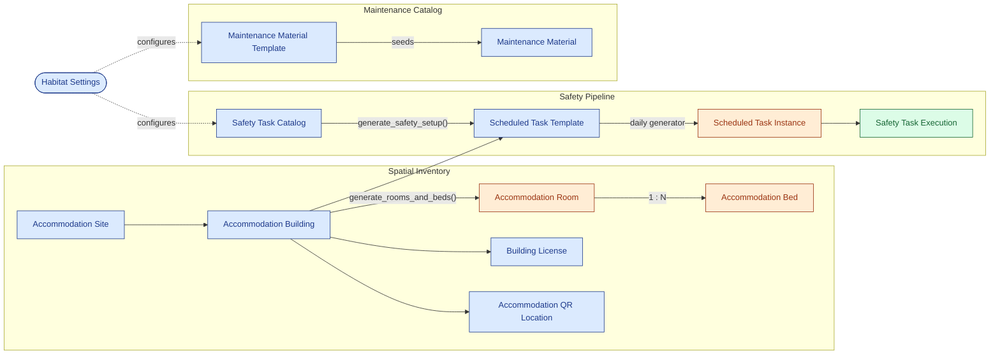
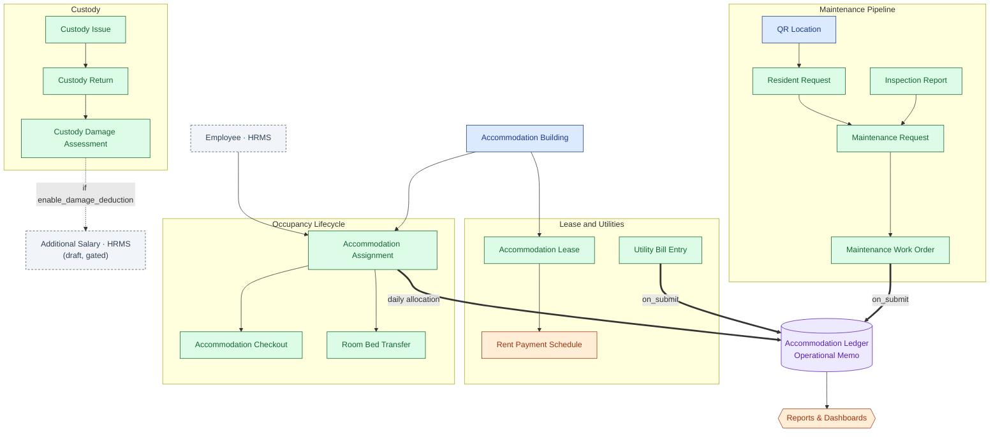
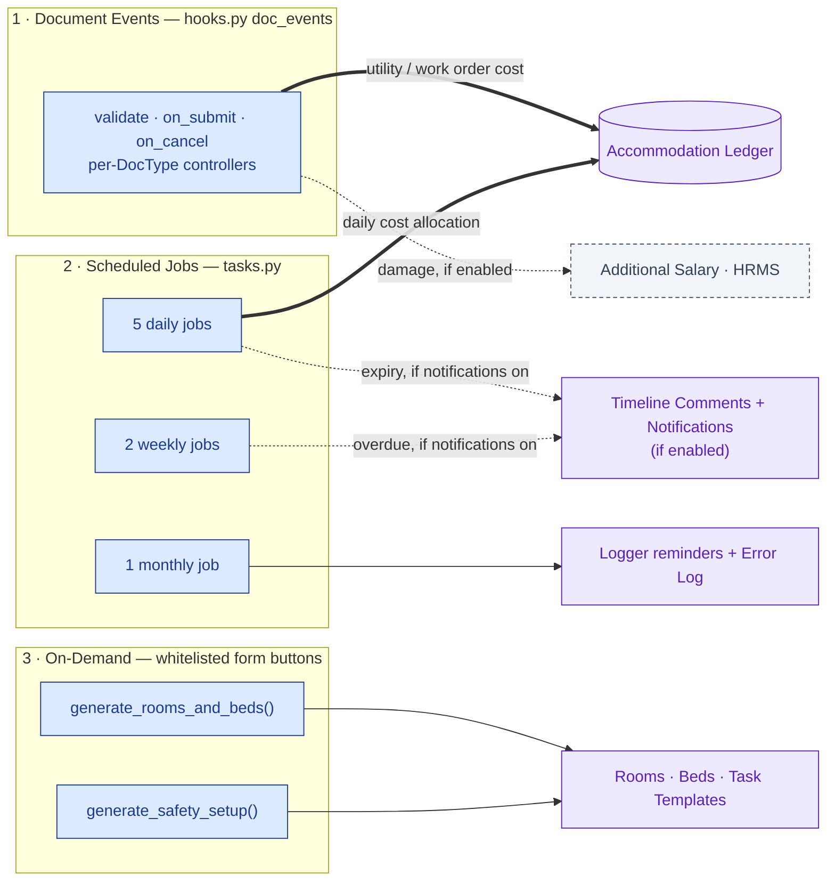

# Apex Habitat

Apex Habitat is a Frappe Framework v15 application for managing worker
accommodation operations. It covers the full estate-to-resident lifecycle:
spatial inventory (sites, buildings, rooms, beds), resident assignment and
transfer, scheduled safety and cleaning tasks, maintenance inspection and work
orders, custody of issued assets, and accommodation cost tracking. Operational
costs are recorded in a dedicated memo ledger that is kept separate from the
ERPNext General Ledger so accommodation analytics never touch standard
accounting entries.

The app exposes a single Frappe module, `Habitat`, containing all DocTypes,
reports, web forms, and workspaces.

## Requirements

| Component        | Version |
| :--------------- | :------ |
| Frappe Framework | v15     |
| ERPNext          | v15     |
| Frappe HRMS      | v15     |
| Python           | 3.10+   |
| MariaDB          | 10.6+   |

ERPNext and HRMS are declared as hard dependencies via `required_apps` in
`hooks.py` (`["frappe", "erpnext", "hrms"]`). They provide the Employee,
Company, Supplier, Cost Center, Salary Component, and Additional Salary records
that Habitat links to.

## Installation

```bash
# Fetch the app into your bench
bench get-app https://github.com/iabodysa/apex.git

# Install onto a site (registers DocTypes and fixtures)
bench --site <site-name> install-app apex_habitat

# Apply schema patches
bench --site <site-name> migrate
```

Installation runs `after_install` (`apex_habitat.setup.after_install`), which
seeds roles, role profiles, custody asset categories, custody articles, the
maintenance material catalog and templates, and the safety task catalog. The
bootstrap is idempotent and safe to re-run.

```bash
# Rebuild assets if needed
bench build --app apex_habitat
```

## Domain Modules

All DocTypes live under `apex_habitat/habitat/doctype/`. Grouped by area:

- **Settings** — Habitat Settings, City, Habitat Operations Alert.
- **Spatial inventory** — Accommodation Site, Accommodation Building,
  Accommodation Floor Plan, Accommodation Room, Accommodation Bed,
  Accommodation QR Location, Building License.
- **Resident lifecycle** — Accommodation Assignment, Accommodation Checkout,
  Room Bed Transfer.
- **Resident self-service** — Accommodation Resident Request (public web form),
  Camera Access Grant, Camera Access Building Scope.
- **Safety** — Safety Task Catalog, Safety Task Building Scope, Scheduled Task
  Template, Scheduled Task Instance, Safety Task Execution, Safety Inspection
  Report, Inspection Finding Item.
- **Maintenance** — Maintenance Inspection Report, Maintenance Request,
  Maintenance Work Order, Maintenance Material, Maintenance Material Template
  (+ template item), Maintenance Procurement Item, Linked Maintenance Request
  Item.
- **Cleaning** — Cleaning Log, Cleaning Log Room Detail.
- **Custody and assets** — Custody Article, Custody Asset Category,
  Custody Issue, Custody Return, Custody Damage Assessment (+ their child item
  tables), Facility Asset, Facility Asset Custody Assignment, Facility Asset
  Movement, Facility Custody Item, Operational Depreciation Policy,
  Non-Financial Depreciation Snapshot, Depreciation Snapshot Item.
- **Subcontractor** — Subcontractor Service Contract, Subcontractor Service
  Order, Subcontractor Building Coverage.
- **Finance and cost** — Accommodation Lease, Rent Payment Schedule,
  Utility Account, Utility Bill Entry, Accommodation Ledger.
- **Audit** — Client Audit Remediation Plan, Audit Remediation Item,
  Audit Remediation Building Scope.

Reports (Script Reports under `habitat/report/`) are derived from these input
DocTypes and include occupancy, ledger, cost distribution, maintenance aging
and backlog, cleaning compliance, safety open findings, utility variance,
custody damage register, operational depreciation aging, and audit remediation
status.

## Data Model Map

A shared color legend is used across the maps below:

- **Blue** = master / configuration records
- **Green** = transactional input records
- **Orange** = generated or derived records
- **Purple** = the memo ledger and external (ERPNext/HRMS) records

### Master records and spatial structure

Durable configuration on the left seeds the spatial inventory and the safety
and maintenance pipelines on the right. Edge labels name the action that
creates the downstream record.



### Transaction flow and the memo ledger

Resident, custody, lease, and maintenance transactions (green) flow toward the
Accommodation Ledger and the operations alert feed (purple). Only three paths
post cost rows to the ledger, and only one path reaches an external HRMS record.



## Backend Engines

Habitat keeps business logic on the server across three execution surfaces:
document-event controllers, scheduled jobs, and on-demand whitelisted actions.
The map shows each surface, what triggers it, and where its output lands.



### Document-event controllers

Wired in `hooks.py` under `doc_events`; the logic lives in each DocType's
controller module. Transactional DocTypes (Assignment, Checkout, Room Bed
Transfer, Utility Bill Entry, Custody Issue/Return/Damage, Work Order, Service
Order, Facility Asset Movement) implement `validate` / `on_submit` /
`on_cancel`. Key side effects:

- **Utility Bill Entry** `on_submit` posts the building's cost share as one
  `Accommodation Ledger` row (Operational Memo); `before_cancel` posts a
  reversal.
- **Maintenance Work Order** `on_submit` posts a `Maintenance` ledger row for
  the work-order cost.
- **Custody Damage Assessment** `on_submit` creates a draft HRMS
  `Additional Salary` deduction, but only when `enable_damage_deduction` is set
  in Habitat Settings and the salary component is configured.
- **Facility Asset Movement** detects intercompany transfers and blocks
  submission until release approval and receiving confirmation are filled.

### Scheduled jobs (`scheduler_events` in `hooks.py`, logic in `tasks.py`)

Each job paginates its source DocType in 500-row batches and isolates per-row
errors (rollback + `log_error`) so one bad record never aborts the batch.

| Job | Frequency | What it does |
| :-- | :-- | :-- |
| `daily_accommodation_cost_allocation` | Daily | Writes one Accommodation Ledger row per active assignment per cost type, using annual cost / days-in-year / building capacity (leap-year aware). Idempotent per day. |
| `daily_building_license_expiry_check` | Daily | Sets Building License status to `Expired` or `Expiring Soon` (lead from `license_expiry_days_before`, default 60) and, if operational notifications are enabled, posts a timeline comment on the license. |
| `open_maintenance_escalation` | Daily | Logs overdue open Maintenance Requests against priority thresholds (24h Critical / 72h High / 168h Medium / 336h Low). |
| `lease_expiry_watchlist` | Daily | Sets `lease_renewal_status = Expired` on past-due building leases and flags leases due within `lease_expiry_days_before` days (default 90) via a timeline comment when notifications are enabled. |
| `daily_scheduled_task_instance_generator` | Daily | Creates a Scheduled Task Instance for each active template whose current period (Daily/Weekly/Monthly/Quarterly/Annually) has none. |
| `weekly_occupancy_sync` | Weekly | Recomputes room and building occupancy counters and status from live assignment counts to correct drift. |
| `weekly_safety_task_compliance_scan` | Weekly | Marks past-due draft Scheduled Task Instances as `Overdue` and posts a timeline comment on each when notifications are enabled. |
| `monthly_rent_due_alert` | Monthly | Logs a reminder for each unpaid Rent Payment Schedule row due this month. No Payment Entry is created. |

### Operational notifications (native, not a custom alert table)

Operational notices use native Frappe features rather than a custom alert
DocType. Controlled by **Habitat Settings → Enable Operational Notifications**
(off by default):

- When enabled, the expiry/overdue jobs post a **timeline Comment** on the source
  document (Building License, Accommodation Building, Scheduled Task Instance).
- Email reminders are configured declaratively through Frappe **Notification**
  records (date-based on the license/lease date fields) with companion Email
  Templates — no custom scheduler code sends mail.
- **Technical exceptions go to the standard Frappe `Error Log`**, never to an
  operational feed.

The legacy `Habitat Operations Alert` DocType is **deprecated for new alerts**
(retained for historical records); the schedulers no longer write to it. The
status fields the jobs still set (`Expired` / `Expiring Soon` / `Overdue`) drive
the number cards on the workspaces.

### On-demand actions

Whitelisted methods on the Accommodation Building controller, triggered by a
button on the form rather than the scheduler:

- `generate_rooms_and_beds(building_name)` — idempotently creates Room and Bed
  records from the building's floor-plan child table; never overwrites occupied
  rooms.
- `generate_safety_setup(building_name)` — idempotently creates Scheduled Task
  Templates for each active Safety Task Catalog entry scoped to the building.

### The Accommodation Ledger boundary

The app does **not** write GL Entries, Payment Entries, or stock transactions.
All operational cost flows (daily allocation, utility charges, work order
expenses) post to the custom `Accommodation Ledger` DocType in
`posting_mode = "Operational Memo"`. It is an analytics and accountability
record only. The single financial-posting exception is the HRMS Additional
Salary draft for damage recovery, which is gated behind
`enable_damage_deduction`.

### Internal Store engine

Custody and maintenance materials are tracked through a decentralized internal
store — **each Accommodation Building is its own store** — without using ERPNext
Stock. The engine mirrors the Accommodation Ledger pattern: a read-only,
system-written, signed-quantity ledger with full reversal on cancel.

- **Accommodation Stock Ledger** (read-only) — one signed-quantity row per stock
  movement. A blank `employee` means the stock sits in the building's store; a
  set `employee` means it is in that employee's custody. A Dynamic Link
  (`item_type` → `Custody Article` or `Maintenance Material`) lets one ledger
  serve both item families. Rows are posted only through helper functions
  (`post_stock_entry`, `reverse_stock_entries`, `get_store_balance`), never
  created by hand. Reversals post a negative mirror entry and mark both rows
  cancelled, so `balance = sum(qty where is_cancelled = 0)`.
- **Custody Issue / Return** post to the ledger on submit (issue moves stock
  store → employee custody; return moves it back) and reverse on cancel. Both are
  idempotent and skip free-text issues with no linked employee.
- **Accommodation Material Transfer** (submittable) moves stock between two
  building stores in two legs: `on_submit` ships stock out of the source store
  (status **In Transit**); the whitelisted `mark_received` lands it in the
  destination store (status **Received**); cancel reverses every posted leg.
  Submit enforces source-store availability per item.
- **Cross-cost-center memo** — when a received transfer crosses cost centers, an
  opt-in setting (`notify_finance_on_liability_transfer`) emails Finance a
  memo so the cross-charge can be recorded manually. **No GL Entry is posted** —
  the Accommodation Ledger memo boundary above still holds.
- **Accommodation Stock Balance** report aggregates the ledger into current
  on-hand quantity and value per building store and per employee custody.

## Workspaces

Nine workspaces are defined under `habitat/workspace/`:

| Folder | Focus |
| :-- | :-- |
| `operations_command_center` | KPI dashboard and alert feed |
| `setup` | Settings, buildings, catalogs, templates |
| `accommodation_lifecycle` | Assignment, checkout, transfer |
| `daily_scheduled_tasks` | Scheduled task instances, cleaning logs |
| `maintenance_remediation` | Requests, work orders, inspections |
| `safety_compliance` | Safety inspections, licenses, findings |
| `custody_asset_control` | Custody and facility-asset records |
| `lease_utilities_cost_control` | Leases, utilities, ledger reports |
| `client_audit_evidence` | Audit remediation plans and status |

## Roles

`after_install` seeds four custom roles: **Accommodation Manager**,
**Resident Supervisor**, **Finance Manager**, and **Internal Auditor**. These
same four roles ship as fixtures (`fixtures` in `hooks.py`). Three role profiles
(Habitat Accommodation Manager, Habitat Resident Supervisor, Habitat Finance
Reviewer) are also created at install.

## Development

```bash
# Run the test suite
bench --site <site-name> run-tests --app apex_habitat
```

- **Patches** — schema migrations are listed in `apex_habitat/patches.txt` and
  run during `bench migrate`. New migrations go under `apex_habitat/patches/`.
- **Translations** — user-facing strings use stable English source strings in
  code, translated through `apex_habitat/translations/ar.csv`.
  Do not place Arabic directly in labels, options, or messages.
- **Permissions guard** — `.github/workflows/permissions-guard.yml` counts
  unaudited `ignore_permissions=True` call sites in production code against a
  fixed baseline. New call sites must be annotated with `# audit-ok` (and the
  baseline raised after security review) or they fail CI. Test files are
  excluded.
- Other CI workflows: `lint.yml`, `test.yml`, `migrate-check.yml`.

### Version files

Keep these three in sync on every release:

1. `apex_habitat/__init__.py` — `__version__`
2. `pyproject.toml` (repo root) — `version`
3. `setup.py` (repo root) — `version`

Patch = translation/README/icon/report polish; minor = new DocTypes, reports,
workspaces, or scheduler behavior; major = breaking data changes (requires
explicit approval).

## License

MIT. Published by Abdullah Fahad Al-Mutairi Co. (AFMCO).
