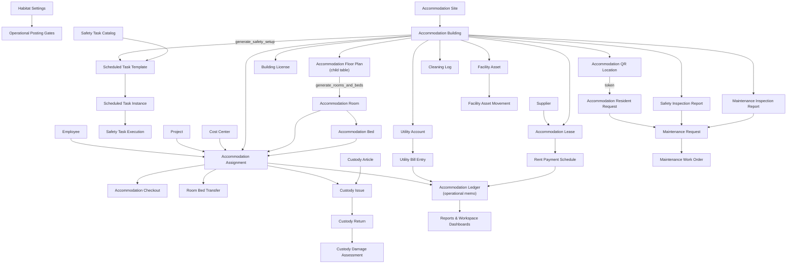

# Apex Habitat

Apex Habitat is a Frappe application for operational accommodation and
facilities management.

It provides structured input paths for housing operations. Operational reports
are derived from submitted records, ledgers, inspections, and scheduled task
execution — not from spreadsheet copies.

## Capabilities

- Spatial hierarchy for sites, buildings, rooms, and beds with a floor-plan
  bulk generator.
- Accommodation assignment, checkout, and room or bed transfer.
- Lease, rent schedule, utility account, and utility bill records.
- Capacity-based operational cost allocation with a memo ledger.
- Custody article issue, return, damage assessment, and non-financial
  depreciation snapshots.
- Facility assets, maintenance requests, work orders, inspections, and
  subcontractor service records with intercompany movement controls.
- Safety task catalogs, building-specific scheduled task generation, safety
  inspection findings, camera access grants, and remediation plans.
- Worker QR intake: scan a room poster to submit a maintenance, safety,
  cleaning, or custody request; requests are triaged internally.
- Reports for occupancy, cost allocation, utility variance, maintenance aging,
  lease expiry, scheduled task compliance, custody damage, and audit
  remediation status.

## Relationship Map



## Workspace Map

| Workspace | Purpose | Primary DocTypes / Reports | User Persona | Notes |
|-----------|---------|----------------------------|--------------|-------|
| **Operations Command Center** | Cross-module KPIs, open queues, exception counts | Number cards, dashboard charts across all modules | Accommodation Manager, Management | Read-only overview; no data entry |
| **Setup** | Configuration, bootstrap records, templates, catalogs, QR locations, accommodation setup wizard, safety setup generator | Habitat Settings, Safety Task Catalog, Scheduled Task Template, Accommodation QR Location, Accommodation Building (setup mode), Custody Asset Category, Operational Depreciation Policy | System Administrator, Accommodation Manager | Run setup actions here, not in operational workspaces |
| **Accommodation Lifecycle** | Resident stays — check-in, check-out, room/bed transfers | Accommodation Assignment, Accommodation Checkout, Room Bed Transfer, Accommodation Room, Accommodation Resident Request | Accommodation Supervisor, Accommodation Manager | Day-to-day occupancy management |
| **Daily & Scheduled Tasks** | Cleaning execution, scheduled task completion, compliance queue | Cleaning Log, Scheduled Task Instance, Scheduled Task Compliance report | Accommodation Supervisor, Cleaning Supervisor | Execution-focused; no setup master data |
| **Maintenance & Remediation** | Repair lifecycle from request to closed work order | Maintenance Request, Maintenance Work Order, Subcontractor Service Order, Maintenance Aging, Maintenance Backlog reports | Maintenance Coordinator, Subcontractor | Includes subcontractor service contracts |
| **Safety & Compliance** | Safety inspections, license watchlist, findings closure | Safety Inspection Report, Safety Task Execution, Building License, Safety Open Findings report | Safety Supervisor, Compliance Officer | Excludes setup masters (catalogs / templates) |
| **Custody & Asset Control** | Article issue, return, damage, depreciation snapshots, facility asset movement | Custody Issue, Custody Return, Custody Damage Assessment, Non-Financial Depreciation Snapshot, Facility Asset, Facility Asset Movement | Custody Supervisor, Internal Auditor | Intercompany movement requires approval gates |
| **Lease, Utilities & Cost Control** | Lease, rent schedule, utility billing, cost allocation ledger | Accommodation Lease, Rent Payment Schedule, Utility Account, Utility Bill Entry, Accommodation Ledger, Accommodation Cost Distribution report | Finance, Accommodation Admin | No direct GL posting from these DocTypes |
| **Client Audit & Evidence** | Client audit remediation tracking and evidence closure | Client Audit Remediation Plan, Audit Remediation Status report | Internal Auditor, Accommodation Manager | Tracks findings, assigned owners, closure evidence |

## Backend Engines

| Engine / Hook / Scheduler | Trigger | Main Records Affected | Safety Boundary | Output / Side Effect |
|---------------------------|---------|----------------------|-----------------|----------------------|
| `daily_accommodation_cost_allocation` | Daily scheduler | Accommodation Ledger | No GL Entry; reads `Habitat Settings` posting gate; skips if capacity = 0 | Writes one operational memo row per active assignment per cost type |
| `daily_building_license_expiry_check` | Daily scheduler | Building License | Status update only; no document or payment created | Sets status to `Expired` or `Expiring Soon` based on `renewal_lead_days` |
| `open_maintenance_escalation` | Daily scheduler | Maintenance Request | Log warning only; no status change, no record created | Logs overdue open requests by priority threshold (Critical 24 h, High 72 h, Medium 168 h) |
| `lease_expiry_watchlist` | Daily scheduler | Accommodation Building | Status update only; no payment created | Sets `lease_renewal_status = Expired` for past-due buildings; logs 90-day warnings |
| `daily_scheduled_task_instance_generator` | Daily scheduler | Scheduled Task Instance | Skips if instance already exists for period; no submit | Creates one `Scheduled Task Instance` per active `Scheduled Task Template` for today's period |
| `weekly_occupancy_sync` | Weekly scheduler | Accommodation Room | Save without GL; no assignment or payment created | Recalculates `current_occupancy` and `status` for every room from live assignment count |
| `weekly_safety_task_compliance_scan` | Weekly scheduler | Scheduled Task Instance | Status update only; no record created | Marks instances with past `due_date` and open/in-progress status as `Overdue` |
| `monthly_rent_due_alert` | Monthly scheduler | Rent Payment Schedule | Log warning only; no Payment Entry created | Surfaces unpaid rent rows due this month for Finance manual action |
| `generate_rooms_and_beds` (whitelisted) | Accommodation Building button | Accommodation Room, Accommodation Bed | Idempotent: skips existing room numbers; never deletes occupied rooms | Creates missing rooms and beds from floor plan child table; updates `setup_status` |
| `generate_safety_setup` (whitelisted) | Accommodation Building button | Scheduled Task Template, Safety Task Building Scope | Idempotent: skips existing templates; no license records with fake numbers | Creates building-specific templates from active `Safety Task Catalog`; sets `safety_setup_status = Completed` |
| Custody Issue / Return / Damage controller | on_submit / validate | Accommodation Ledger, Additional Salary | `Additional Salary` requires settings gate + approval data; no direct GL Entry | Validates item condition, deduction eligibility, and custody state transitions |
| Facility Asset Movement controller | validate / on_submit | Facility Asset Movement | Intercompany moves require source and receiving supervisor approval before final submit | Enforces movement category, company mismatch guards, and intercompany approval gates |
| Accommodation Resident Request controller | after_insert | Maintenance Request (conditional) | No financial records; auto-route to Maintenance only for repair categories | Resolves QR token to site/building/room; sets priority from category and keywords; creates linked Maintenance Request for applicable categories |
| Maintenance Work Order controller | on_submit | Accommodation Ledger | No GL Entry; operational memo only if cost is recorded | Writes work-order cost memo to Accommodation Ledger on submission |

## Financial Safety Boundary

Apex Habitat does not post to the ERPNext General Ledger directly.

- **Accommodation Ledger** is an operational memo ledger owned by Habitat.
  Rows record cost allocations, utility entries, and work-order cost memos for
  internal tracking only.
- `Additional Salary` creation is gated behind an explicit `Habitat Settings`
  checkbox and requires existing approval and authorization data. It is never
  triggered automatically.
- `Payment Entry` and `Purchase Invoice` are not created by any Habitat
  controller or scheduler. Finance processes these manually from the Habitat
  operational record as the source document.
- Intercompany movement triggers an internal approval trail in
  `Facility Asset Movement`. No accounting ownership transfer occurs until
  Finance acknowledges the movement separately.

## Requirements

- Frappe Framework v15 or later.
- ERPNext for native master and transaction references.
- HRMS when payroll deduction integration is enabled.

## Installation

Use an existing Frappe bench and always specify the target site:

```bash
bench get-app https://github.com/iabodysa/apex.git
bench --site "$FRAPPE_SITE" install-app apex_habitat
bench --site "$FRAPPE_SITE" migrate
```

## License

MIT
