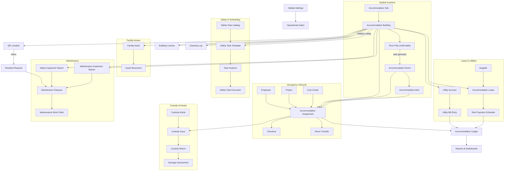
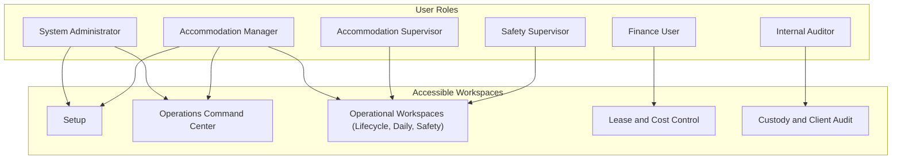

# Apex Habitat

  

Apex Habitat manages worker accommodation operations for facilities in Saudi Arabia — from building and room allocation to maintenance coordination, utility cost tracking, and lease management. The application runs on Frappe Framework v15 and integrates with ERPNext and HRMS for payroll and cost workflows.

> **Note:** Apex Habitat stores financial metrics in a dedicated memo ledger that is isolated from the ERPNext General Ledger. This keeps operational cost tracking clean and auditable without interfering with standard accounting.

---

## Key Features

- **Spatial inventory** — hierarchical site → building → floor → room → bed structure with bulk generation from floor-plan templates
- **Accommodation assignment** — check-in, check-out, and room-bed transfer workflows linked to ERPNext Employee, Project, and Cost Center
- **Resident request intake** — QR-linked web form allowing residents to submit requests from any mobile device without a login
- **Maintenance pipeline** — inspection reports route automatically to maintenance requests, which progress to work orders with completion-photo enforcement
- **Subcontractor coordination** — service contracts, dispatch assignments, and work order closure tracking
- **Lease management** — structured billing cycles with auto-generated payment schedules and landlord utility-share configuration
- **Utility cost splitting** — shared-meter bill entry with configurable cost-share percentages across buildings
- **Custody and asset tracking** — custody article issuance, returns, damage assessment, and HRMS salary deduction integration
- **Safety inspection automation** — building safety templates generate daily task instances from a configurable catalog
- **Building license tracking** — automated expiry checks with Expiring Soon and Expired status transitions
- **Operational memo ledger** — cost allocations, utility charges, and work order expenses recorded in isolation from the ERPNext GL
- **Maintenance material catalog** — issue-type templates preload material kits onto work orders in a single step
- **9 role-based workspaces** — tailored desktops for managers, supervisors, finance, safety, custody, audit, and subcontractor users
- **Full Arabic UI** — all user-facing labels, statuses, and messages delivered through the Frappe translation system

---

## Relationship Map



---

## Workspace Map

```mermaid
flowchart TD
    subgraph Workspaces ["Habitat Workspaces"]
        OCC["Operations Command Center"]
        Setup["Setup"]
        Lifecycle["Accommodation Lifecycle"]
        Daily["Daily and Scheduled Tasks"]
        Maintenance["Maintenance and Remediation"]
        Safety["Safety and Compliance"]
        Custody["Custody and Asset Control"]
        Lease["Lease, Utilities, and Cost Control"]
        ClientAudit["Client Audit and Evidence"]
    end

    subgraph Roles ["User Roles"]
        Admin["System Administrator"]
        Manager["Accommodation Manager"]
        Supervisor["Accommodation Supervisor"]
        Cleaner["Cleaning Supervisor"]
        MaintCoord["Maintenance Coordinator"]
        Subcon["Subcontractor"]
        SafetySup["Safety Supervisor"]
        Compliance["Compliance Officer"]
        CustodySup["Custody Supervisor"]
        Auditor["Internal Auditor"]
        Finance["Finance User"]
    end

    Admin --> Setup
    Admin --> OCC
    Manager --> OCC
    Manager --> Setup
    Manager --> Lifecycle
    Manager --> ClientAudit
    Supervisor --> Lifecycle
    Supervisor --> Daily
    Cleaner --> Daily
    MaintCoord --> Maintenance
    Subcon --> Maintenance
    SafetySup --> Safety
    Compliance --> Safety
    CustodySup --> Custody
    Auditor --> Custody
    Auditor --> ClientAudit
    Finance --> Lease
```



### Workspace Descriptions

| Workspace | Purpose |
| :--- | :--- |
| **Operations Command Center** | Cross-module KPIs, open queues, and exception charts — read-only overview for managers |
| **Setup** | Global settings, bootstrap templates, QR locations, and master data generation |
| **Accommodation Lifecycle** | Check-in, check-out, and room-transfer transactions |
| **Daily and Scheduled Tasks** | Operations queue for scheduled cleaning logs and daily inspection tasks |
| **Maintenance and Remediation** | Subcontractor dispatch, work orders, and maintenance coordination |
| **Safety and Compliance** | Inspection reports, safety task monitoring, and building license tracking |
| **Custody and Asset Control** | Custody issuance, returns, damage assessment, and asset movement records |
| **Lease, Utilities, and Cost Control** | Lessor contracts, utility bills, rent schedules, and cost distribution |
| **Client Audit and Evidence** | Audit remediation plans and supporting evidence files |

---

## Roles and Responsibilities



### Responsibility Assignment Matrix (responsibility)

- **A** = Accountable
- **R** = Responsible
- **C** = Consulted
- **I** = Informed

| Core Workflow | System Admin | Accommodation Manager | Resident Supervisor | Safety Supervisor | Custody Supervisor | Finance User | Internal Auditor |
| :--- | :---: | :---: | :---: | :---: | :---: | :---: | :---: |
| **Spatial Inventory Setup** | **R** | **A** | **C** | **I** | **I** | **I** | **I** |
| **Accommodation Assignment** | **I** | **A** | **R** | **I** | **I** | **I** | **I** |
| **Custody and Asset Control** | **I** | **A** | **C** | **I** | **R** | **I** | **C** |
| **Facility Maintenance** | **I** | **A** | **R** | **I** | **I** | **I** | **I** |
| **Safety and Inspection Reports** | **I** | **A** | **I** | **R** | **I** | **I** | **I** |
| **Lease and Utility Contracts** | **I** | **A** | **I** | **I** | **I** | **R** | **I** |
| **Client Audit Remediation** | **A** | **R** | **I** | **I** | **I** | **I** | **R** |

---

## Backend Engines and Automation

The application uses scheduler-driven tasks and controller hooks to automate background processes.

```mermaid
flowchart TD
    subgraph Daily ["Daily Schedulers"]
        CostAlloc["Cost Allocation"]
        LicenseCheck["License Expiry Check"]
        MaintEsc["Maintenance Escalation"]
        LeaseWatch["Lease Expiry Watch"]
        TaskGen["Safety Task Instance Generator"]
    end

    subgraph Weekly ["Weekly Schedulers"]
        OccupancySync["Occupancy Sync"]
        ComplianceScan["Safety Compliance Scan"]
    end

    subgraph Monthly ["Monthly Schedulers"]
        RentAlert["Rent Due Alert"]
    end

    subgraph Triggers ["On-Demand Hooks"]
        RoomGen["Bulk Room and Bed Generation"]
        SafetySetup["Safety Template Initialization"]
        ResidentRequestHook["Resident Request Router"]
        WorkOrderHook["Work Order Completion Hook"]
        AssetMoveHook["Asset Movement Gate"]
    end

    CostAlloc -->|writes| Ledger["Accommodation Ledger"]
    WorkOrderHook -->|writes| Ledger
    RoomGen -->|creates| RoomsBeds["Rooms and Beds"]
    SafetySetup -->|creates| ScheduledTasks["Safety Task Templates"]
    ResidentRequestHook -->|routes| MaintenanceRequest["Maintenance Request"]
    AssetMoveHook -->|gates| IntercompanyApproval["Intercompany Approval"]
```



### Scheduler Reference

| Job | Frequency | Description |
| :--- | :--- | :--- |
| `daily_accommodation_cost_allocation` | Daily | Distributes cost metrics to the memo ledger. Skips posting when gate controls in Settings are inactive or building capacity is zero. |
| `daily_building_license_expiry_check` | Daily | Updates license statuses (Expired, Expiring Soon) using configurable renewal lead-day thresholds. |
| `open_maintenance_escalation` | Daily | Scans and logs overdue unresolved maintenance orders categorized by priority rules. |
| `lease_expiry_watchlist` | Daily | Flags buildings with expired lease dates. |
| `daily_scheduled_task_instance_generator` | Daily | Spawns today's inspection instances from active safety task templates. |
| `weekly_occupancy_sync` | Weekly | Syncs live room occupancy metrics from current employee assignment counts. |
| `weekly_safety_task_compliance_scan` | Weekly | Marks past-due unfinished safety tasks as Overdue. |
| `monthly_rent_due_alert` | Monthly | Notifies finance of unpaid rent periods. |

---

## Technical Design and Boundaries

### Operational Memo Ledger

Apex Habitat does not write directly to the ERPNext financial General Ledger. Instead:

- All cost recoveries, allocations, and work order expenses are recorded in the custom **Accommodation Ledger** DocType for dashboard KPI analytics.
- Integration with standard ERPNext modules (such as HRMS payroll deductions via `Additional Salary`) is gated behind explicit settings approvals, preventing unintended financial postings.

### UI Styling and Customization

- Custom interface adjustments are scoped to workspace classes in `afmco_theme.css`.
- No global CSS selector overrides — only workspace-class-scoped rules.
- Compatible with Frappe's built-in light and dark color schemes and RTL layout for Arabic-locale deployments.

---

## Directory Structure

```
apex_habitat/
├── README.md
├── pyproject.toml
├── setup.py
└── apex_habitat/
    ├── __init__.py
    ├── hooks.py                # Hook mappings, scheduler setup, and theme registration
    ├── setup.py                # After-install role and permissions bootstrap
    ├── translations/           # Arabic translation catalog (ar.csv)
    ├── public/
    │   └── css/
    │       └── afmco_theme.css # Scoped workspace overrides and dark mode style fixes
    └── habitat/                # Custom operational logic
        ├── doctype/            # Core DocTypes (Assignment, Lease, Ledger, Custody, etc.)
        ├── report/             # Custom occupancy and variance reports
        ├── web_form/           # Resident request intake web forms
        ├── workspace/          # Configured workspaces (OCC, Lifecycle, Maintenance)
        └── tasks.py            # Scheduler execution logic
```

---

## Installation

```bash
# Add the app to your bench directory
bench get-app https://github.com/iabodysa/apex.git

# Install the app on your site
bench --site [your-site-name] install-app apex_habitat

# Run database migrations to register custom DocTypes and schema
bench --site [your-site-name] migrate
```

---

## License

MIT
