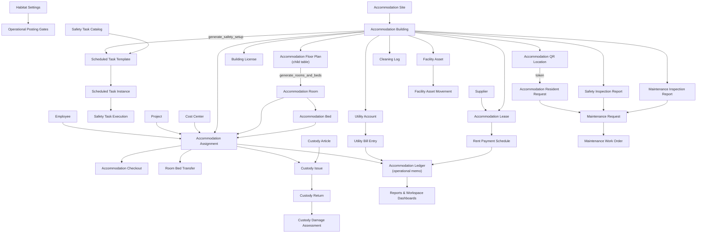
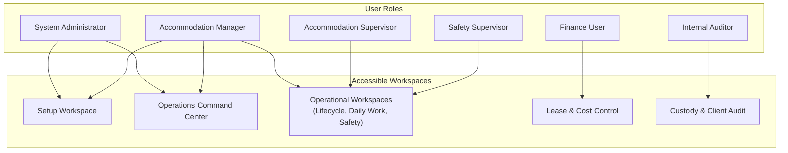

# Apex Habitat

Apex Habitat is a custom application for the Frappe Framework. It provides operational accommodation, occupancy tracking, and facilities maintenance management. The application integrates with ERPNext and HRMS to process data workflows and track operational records.

> [!NOTE]
> This application is built for Frappe v15. It handles accommodation workflows operationally, storing financial metrics in a dedicated memo ledger to isolate tracking from the core ERPNext General Ledger.

---

## Relationship Map

This flowchart maps the relationships between master records, transactional documents, and ledgers within the application.



---

## Workspace Map & Profiles

The workspace hierarchy structures desktop accessibility based on operational roles.

```mermaid
flowchart TD
    subgraph Workspaces ["Habitat Workspaces"]
        OCC["Operations Command Center"]
        Setup["Setup"]
        Lifecycle["Accommodation Lifecycle"]
        Daily["Daily & Scheduled Tasks"]
        Maintenance["Maintenance & Remediation"]
        Safety["Safety & Compliance"]
        Custody["Custody & Asset Control"]
        Lease["Lease, Utilities & Cost Control"]
        ClientAudit["Client Audit & Evidence"]
    end

    subgraph Roles ["User Personas"]
        Admin["System Administrator"]
        Manager["Accommodation Manager"]
        Supervisor["Accommodation Supervisor"]
        Cleaner["Cleaning Supervisor"]
        MaintCoord["Maintenance Coordinator"]
        Subcon["Subcontractor"]
        SafetySup["Safety Supervisor"]
        Compliance["Compliance Officer"]
        CustodySup["Custody Supervisor"]
        Auditor["Internal Auditor"]
        Finance["Finance"]
    end

    Manager --> OCC
    Manager --> Setup
    Manager --> Lifecycle
    Manager --> ClientAudit
    Admin --> Setup
    Supervisor --> Lifecycle
    Supervisor --> Daily
    Cleaner --> Daily
    MaintCoord --> Maintenance
    Subcon --> Maintenance
    SafetySup --> Safety
    Compliance --> Safety
    CustodySup --> Custody
    Auditor --> Custody
    Auditor --> ClientAudit
    Finance --> Lease
```



### Workspace Specifications
- **Operations Command Center**: Cross-module KPIs, open queues, and exception charts. Read-only overview.
- **Setup**: Global settings, bootstrap templates, QR locations, and master data generation wizards.
- **Accommodation Lifecycle**: Manages occupancy transactions (check-ins, check-outs, room transfers).
- **Daily & Scheduled Tasks**: Operations queue for scheduled cleaning logs and daily tasks.
- **Maintenance & Remediation**: Coordination hub for subcontractor assignments and maintenance work orders.
- **Safety & Compliance**: Inspection reports, building safety monitoring, and license tracking.
- **Custody & Asset Control**: Records asset movement, custody issue/returns, and damage recovery.
- **Lease, Utilities & Cost Control**: Monitors lessor contracts, utility bills, and internal cost distributions.
- **Client Audit & Evidence**: Houses audit remediation plans and evidence files.

---

## Roles Map & RACI Matrix



### Responsibility Assignment Matrix (RACI)

Below is the lightweight RACI structure mapping core application workflows to standard user roles.

- **A** = Accountable (من يعتمد)
- **R** = Responsible (من ينفذ)
- **C** = Consulted (من يستشار)
- **I** = Informed (من يشعر)

| Core Workflow Process | System Admin | Accommodation Manager | Resident Supervisor | Safety Supervisor | Custody Supervisor | Finance User | Internal Auditor |
| :--- | :---: | :---: | :---: | :---: | :---: | :---: | :---: |
| **Spatial Inventory Setup** | **R** | **A** | **C** | **I** | **I** | **I** | **I** |
| **Accommodation Assignment** | **I** | **A** | **R** | **I** | **I** | **I** | **I** |
| **Custody & Asset Control** | **I** | **A** | **C** | **I** | **R** | **I** | **C** |
| **Facility Maintenance** | **I** | **A** | **R** | **I** | **I** | **I** | **I** |
| **Safety & Inspection Reports**| **I** | **A** | **I** | **R** | **I** | **I** | **I** |
| **Lease & Utility Contracts** | **I** | **A** | **I** | **I** | **I** | **R** | **I** |
| **Client Audit Remediation** | **A** | **R** | **I** | **I** | **I** | **I** | **R** |

---

## Backend Engines & Automation

The application uses scheduler-driven tasks and event hooks to automate background processes.

```mermaid
flowchart TD
    subgraph Schedulers ["Daily / Weekly Schedulers"]
        CostAlloc["daily_accommodation_cost_allocation"]
        LicenseCheck["daily_building_license_expiry_check"]
        MaintEsc["open_maintenance_escalation"]
        LeaseWatch["lease_expiry_watchlist"]
        TaskGen["daily_scheduled_task_instance_generator"]
        OccupancySync["weekly_occupancy_sync"]
        ComplianceScan["weekly_safety_task_compliance_scan"]
        RentAlert["monthly_rent_due_alert"]
    end

    subgraph Triggers ["On-Demand & Controller Hooks"]
        RoomGen["generate_rooms_and_beds"]
        SafetySetup["generate_safety_setup"]
        CustodyHook["Custody Controller Hooks"]
        AssetMoveHook["Facility Asset Movement Hook"]
        ResidentRequestHook["Resident Request Hook"]
        WorkOrderHook["Work Order Hook"]
    end

    CostAlloc -->|writes| Ledger["Accommodation Ledger"]
    WorkOrderHook -->|writes| Ledger
    RoomGen -->|creates| RoomsBeds["Rooms & Beds"]
    SafetySetup -->|creates| ScheduledTasks["Scheduled Tasks"]
    ResidentRequestHook -->|routes| MaintenanceRequest["Maintenance Request"]
    AssetMoveHook -->|gates| IntercompanyApproval["Intercompany Approval"]
```



### Automation Specifications
- **daily_accommodation_cost_allocation**: Distributes cost metrics to the memo ledger. Skips posting if gate controls in Settings are inactive or building capacity is zero.
- **daily_building_license_expiry_check**: Updates license statuses (Expired, Expiring Soon) automatically using renewal lead day thresholds.
- **open_maintenance_escalation**: Scans and logs overdue unresolved maintenance orders categorized by priority rules.
- **lease_expiry_watchlist**: Flags buildings with expired lease dates.
- **daily_scheduled_task_instance_generator**: Automatically spawns today's inspection instances from active safety templates.
- **weekly_occupancy_sync**: Syncs live room occupancy metrics using real-time employee assignment counts.
- **weekly_safety_task_compliance_scan**: Marks past-due unfinished safety tasks as Overdue.
- **monthly_rent_due_alert**: Signals finance about unpaid rent periods.
- **generate_rooms_and_beds**: Idempotent builder on Building master to bulk-generate rooms/beds based on floor plans.
- **generate_safety_setup**: Generates building safety templates from the global catalog.

---

## Technical Design & Boundaries

### Operational Memo Ledger
To separate operational transactions from standard accounting procedures, Apex Habitat does not write directly to the ERPNext financial General Ledger:
- All cost-recoveries, allocations, and work order expenses populate the custom **Accommodation Ledger** (`Accommodation Ledger` DocType) for dashboard KPI analytics.
- Integration triggers for standard ERPNext modules (such as payroll deduction records via `Additional Salary` in HRMS) are gated behind manual settings approvals.

### UI Styling & Customization
- Custom interface adjustments are scoped to workspace classes in `afmco_theme.css`.
- Applies scoped CSS overrides to workspace elements without modifying global CSS selectors.
- Retains native support for light and dark color schemes.

---

## Directory Structure

```
apex_habitat/
├── README.md
├── pyproject.toml
├── setup.py
└── apex_habitat/
    ├── __init__.py
    ├── hooks.py                # Hook mappings, scheduler setup, and theme registration
    ├── setup.py                # After-install role/permissions bootstrap logic
    ├── translations/           # Arabic translation catalog (ar.csv)
    ├── public/
    │   └── css/
    │       └── afmco_theme.css # Scoped workspace overrides and dark mode style fixes
    └── habitat/                # Custom operational logic
        ├── doctype/            # Core DocTypes (Assignment, Lease, Ledger, Custody, etc.)
        ├── report/             # Custom occupancy and variance reports
        ├── web_form/           # Resident request intake web forms
        ├── workspace/          # Configured workspaces (OCC, Lifecycle, Maintenance)
        └── tasks.py            # Scheduler execution logic
```

---

## Installation & Deployment

```bash
# Add the app to your bench directory
bench get-app https://github.com/iabodysa/apex.git

# Install the app on your site
bench --site [your-site-name] install-app apex_habitat

# Run database migrations to register the custom DocTypes and schema
bench --site [your-site-name] migrate
```

## License

MIT
