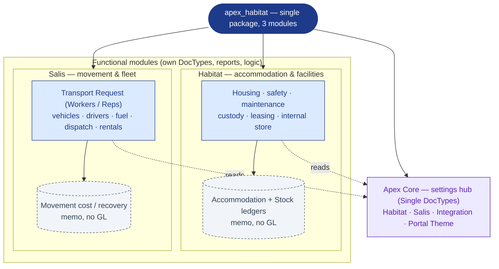
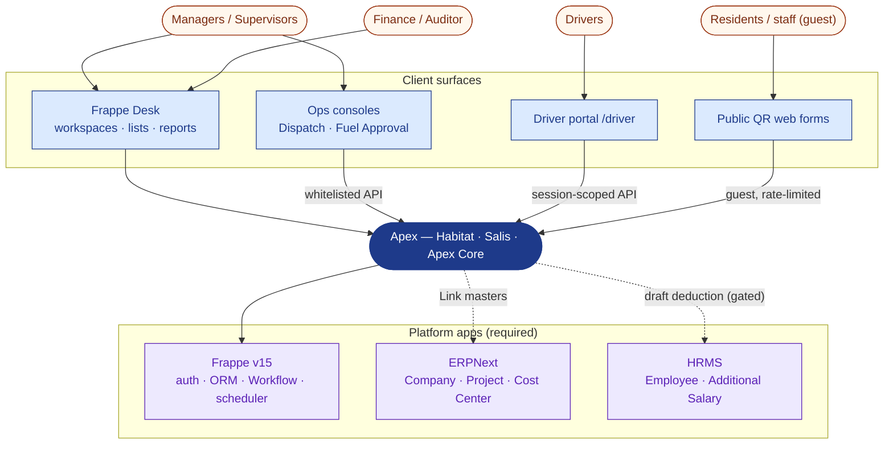
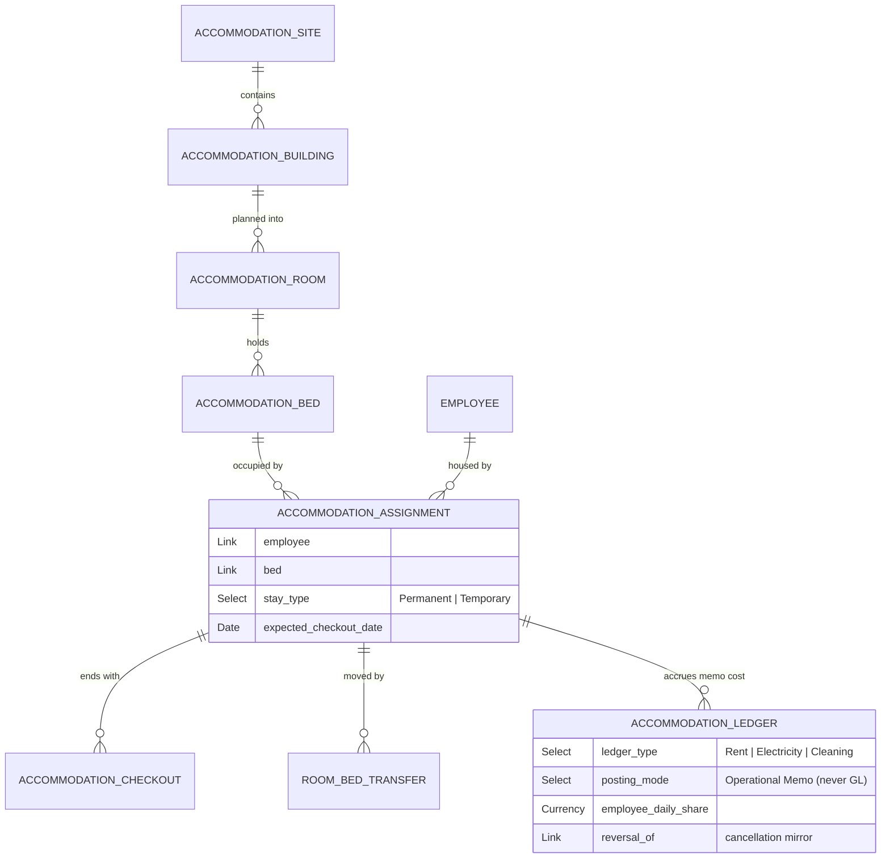
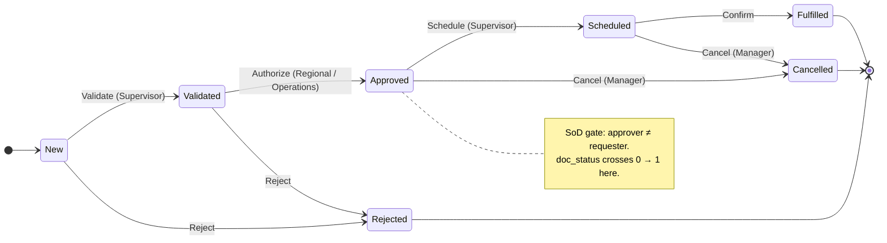
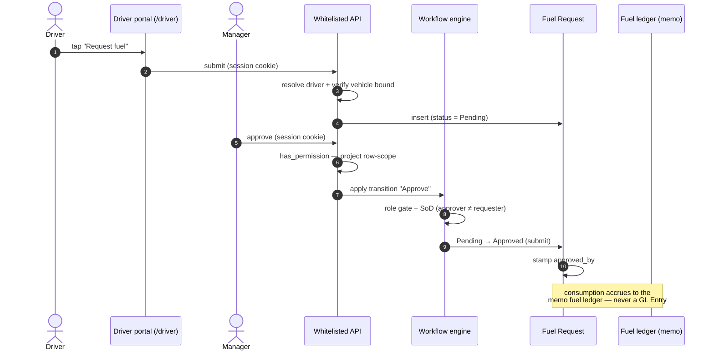
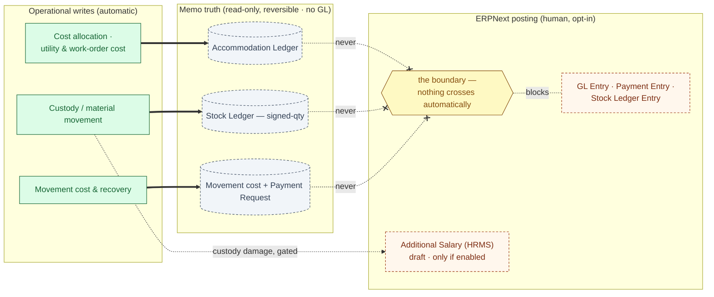

# Apex

Apex is a workforce-operations suite on Frappe v15, ERPNext, and HRMS. It runs two lifecycles on one platform: the estate-to-resident housing lifecycle and the worker/representative movement lifecycle.

It ships as a single Frappe package (`apex_habitat`) with three modules — **Habitat**, **Salis**, and **Apex Core**. Its defining decision is a **memo-ledger cost model**: every operational cost and stock movement posts to purpose-built, read-only memo ledgers that are isolated from the ERPNext General Ledger. Cost, cross-charge, and on-hand inventory stay fully traceable; financial posting remains a deliberate, human decision.

## Modules

- **Habitat** — accommodation and facilities: spatial inventory (sites, buildings, rooms, beds), resident assignment/transfer/checkout, scheduled safety and cleaning work, maintenance and work orders, custody of issued assets, a decentralized internal store, and lease/utility cost control.
- **Salis** — movement and fleet: a two-division service model on **Transport Request** (`service_line` = Workers vs Representatives), a shared vehicle/driver/fuel/dispatch backbone, vehicle rentals and cost recovery, a native-Frappe **Workflow** approval spine across its submittable documents, and a mobile **driver portal** (`/driver`) with a theme driver, an English/Arabic language toggle, and driver-profile and assigned-vehicle views.
- **Apex Core** — the settings hub: the Single DocTypes **Habitat Settings**, **Salis Settings**, **Apex Integration Settings**, and **Salis Portal Theme** that the functional modules and portal read for thresholds, toggles, default company/cost-center, and portal appearance.

## Architecture

The architecture is documented from a few complementary perspectives; each diagram carries a one-line caption.

### Modules and what each owns

One package hosts three modules. Habitat and Salis own their DocTypes, reports, workspaces, and logic; Apex Core holds the shared settings both read. Every operational write lands in a module-owned memo ledger, never the General Ledger.



### System context

Black-box view of who and what Apex talks to. Desk users and operations consoles use the standard Frappe session; the `/driver` portal is a themeable, mobile web app — English/Arabic toggle, driver-profile and assigned-vehicle views — that resolves the signed-in user to a driver server-side; two public QR web forms accept rate-limited guest submissions.



### Residency data model

Static view of the housing core. A site contains buildings; a building is planned into rooms and beds; an assignment places an employee in a bed and is the unit of occupancy. Every cost it incurs becomes an **Accommodation Ledger** memo row — analytics, never a GL entry.



### Approval state machine (Salis)

Dynamic state view. Salis submittable documents move on native Frappe Workflows (in `salis/workflow/`), not custom controllers — **ten documents** in all. Each transition is gated by an allowed role and a Segregation-of-Duties condition (approver ≠ requester); large-scope requests escalate to an Operations tier via the server-derived `needs_operations` flag. **Transport Request** is shown as the representative spine.



The same role + SoD pattern governs the rest of the spine: Fuel Request, Fuel Claim, Fuel Exception Case, Rental Settlement, Salis Payment Request, Dispatch Trip, Driver Clearance, and Support Ticket.

### Request-to-fulfilment sequence

Dynamic view across the wire: a fuel request from the driver portal to a manager approving on the desk console, showing where each guard fires. The portal resolves the driver from the session; the console call runs the per-document project row-scope check; the Workflow applies the role + SoD gate. No GL entry is written.



### Backend surfaces

All business logic lives on the server across three surfaces:

- **Document events** — `validate` / `on_submit` / `on_cancel` controllers wired in `hooks.py` (`doc_events`) on submittable transactions.
- **Scheduled jobs** — `scheduler_events` registers **17 daily, 4 weekly, 2 monthly** jobs across Habitat and Salis (cost accrual, occupancy sync, compliance and expiry watches, fuel/rental accrual, monthly reconciliations). Each paginates its source in 500-row batches and isolates per-row failures so one bad record never aborts a run.
- **On-demand actions** — whitelisted form buttons: `generate_rooms_and_beds`, `generate_safety_setup`, `mark_received`.

Operational alerting uses native Frappe primitives — Calendar views, Kanban boards, Assignment Rules, Notifications with Email Templates, Auto Email Reports, and ToDo follow-ups — all **disabled by default**, so automation is an explicit operator choice. Technical exceptions go to the standard Error Log and Scheduled Job Log.

## Data integrity: the no-GL boundary

Apex **never** writes GL Entries, Payment Entries, or ERPNext Stock Ledger Entries. Every operational write resolves to a module-owned memo record; the General Ledger sits on the far side of a line nothing crosses automatically.



Two memo ledgers carry all operational truth. The **Accommodation Ledger** records every operational cost in `posting_mode = "Operational Memo"` (`on_submit` posts, `before_cancel` posts the reversal). The **Accommodation Stock Ledger** is a read-only, signed-quantity ledger for the internal store, written only through helper functions and reversed by a negative mirror row; on-hand balance is `sum(qty where is_cancelled = 0)`. The single financial-posting exception is a draft HRMS *Additional Salary* deduction for custody damage, which fires only when enabled in Habitat Settings.

## Roles and bootstrap

An idempotent `after_install` bootstrap (safe to re-run) seeds four custom roles — **Accommodation Manager**, **Resident Supervisor**, **Finance Manager**, **Internal Auditor** — plus three role profiles, and the custody, maintenance-material, and safety-task catalogs.

## Localization

The desk is delivered fully in Arabic through Frappe translation files (`apex_habitat/translations/ar.csv`). The driver portal stays English-first for a multinational workforce, with an in-portal English/Arabic toggle.

## Install

Apex installs like any standard Frappe app:

```bash
bench get-app apex_habitat
bench --site <site> install-app apex_habitat
bench --site <site> migrate
```

Requires Frappe, ERPNext, and HRMS on v15 (declared via `required_apps`), Python 3.10+, and MariaDB 10.6+. Installation runs the idempotent `after_install` bootstrap.

## License

MIT. Published by AFMCO Support Services Co. Ltd.
