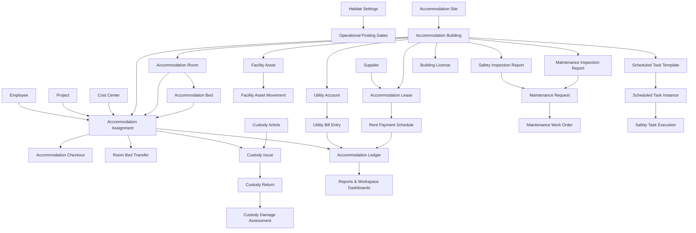

# Apex Habitat

Apex Habitat is a Frappe application for operational accommodation and
facilities management.

It provides structured input paths for housing operations rather than copying
spreadsheet tabs into DocTypes. Operational reports are derived from submitted
records, ledgers, inspections, and scheduled task execution.

## Capabilities

- Spatial hierarchy for sites, buildings, rooms, and beds.
- Accommodation assignment, checkout, and room or bed transfer.
- Lease, rent schedule, utility account, and utility bill records.
- Capacity-based operational cost allocation.
- Custody article issue, return, damage assessment, and non-financial
  depreciation snapshots.
- Facility assets, maintenance requests, work orders, inspections, and
  subcontractor service records.
- Safety task catalogs, scheduled task execution, inspection findings, camera
  access grants, and remediation plans.
- Query reports for occupancy, cost allocation, utility variance, maintenance
  backlog, lease expiry, scheduled task compliance, custody damage, and audit
  remediation status.

## Relationship Map



## Requirements

- Frappe Framework v15 or later.
- ERPNext for native master and transaction references.
- HRMS when payroll deduction integration is enabled.

## Installation

Use an existing Frappe bench and always specify the target site:

```bash
bench get-app https://github.com/iabodysa/apex.git
bench --site "$FRAPPE_SITE" install-app apex_habitat
bench --site "$FRAPPE_SITE" migrate
```

## License

MIT
