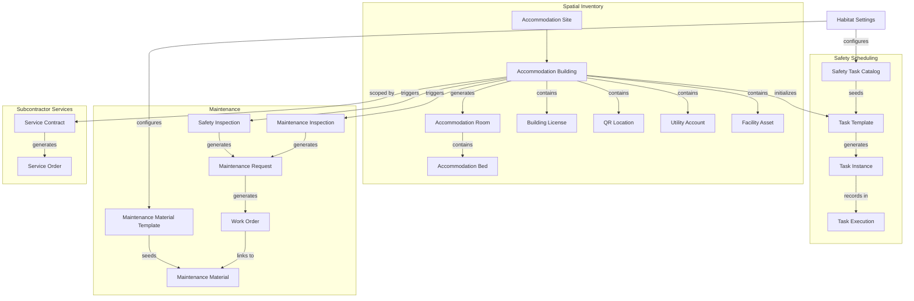
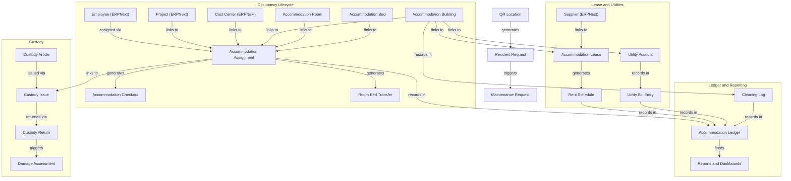

# Apex Habitat

  

Apex Habitat gives facilities operators in Saudi Arabia a single system to manage worker accommodation — allocating buildings and rooms, tracking occupancy across contract periods, recording maintenance tasks and inspections, monitoring utility costs per unit, and coordinating the lease and renewal lifecycle. It runs on Frappe Framework v15 and connects to ERPNext and HRMS for payroll deduction and cost recovery workflows.

> **Note:** Operational cost metrics are stored in a dedicated memo ledger, separate from the ERPNext General Ledger, so accommodation tracking stays auditable without affecting standard accounting entries.

---

## Key Features

**Setup and master data**
- Define the full accommodation estate — sites, buildings, floors, rooms, and individual beds — and generate large batches of units from a floor-plan template without manual entry.
- Attach QR codes to physical locations so residents can identify their room and submit requests instantly from a mobile device without creating an account.
- Maintain building licenses with automatic status alerts when renewal deadlines are approaching or have passed.

**Resident lifecycle**
- Check residents in and out, and transfer them between rooms or buildings, with each movement linked to the relevant employee record, project, and cost center.
- Generate structured lease agreements with automatic payment schedules and configurable cost-share arrangements between the company and the landlord.

**Operations and service delivery**
- Allow residents to raise maintenance and service requests by scanning a QR code — no portal login required.
- Manage the full service pipeline from inspection report through maintenance request to work order, including photo confirmation at closure.
- Register facility assets, track their movement between locations, and log cleaning activity by building and area.
- Manage subcontractor service contracts, assign work orders to external teams, and record completion against each contract.

**Safety**
- Configure building-specific safety inspection checklists and have the system generate daily task instances automatically.
- Record inspection findings and link corrective actions directly to the maintenance workflow.

**Maintenance materials**
- Define standard material kits for common issue types so that work orders are pre-populated with required materials in a single step.
- Track material consumption per work order for cost and inventory awareness.

**Finance and cost control**
- Record utility bills against shared meters and apportion costs across buildings using configurable percentage splits.
- Issue and return custody items to employees, assess damage, and automatically feed deduction amounts to payroll.
- Capture accommodation-related costs — including utility charges, work order expenses, and cost allocations — separately from the main ERP general ledger to preserve clean financial boundaries.
- Track rent payment schedules and monitor settlement status across the portfolio.

**Reporting and access**
- Nine role-tailored workspaces give managers, supervisors, finance staff, safety officers, custody coordinators, auditors, and subcontractor users a focused view of their own tasks and data.
- All labels, statuses, and messages are delivered in Arabic through the translation system, with English source strings maintained in code for future localization.

---

## Relationship Map — Part 1: Master Records and Spatial Structure



---

## Relationship Map — Part 2: Transaction Flow and Ledger



---

## Workspace Map

| Workspace | Primary Roles |
| :--- | :--- |
| **Operations Command Center** | System Administrator, Accommodation Manager |
| **Setup** | System Administrator, Accommodation Manager |
| **Accommodation Lifecycle** | Accommodation Manager, Resident Supervisor |
| **Daily and Scheduled Tasks** | Resident Supervisor, Cleaning Supervisor |
| **Maintenance and Remediation** | Maintenance Coordinator, Subcontractor |
| **Safety and Compliance** | Safety Supervisor, Compliance Officer |
| **Custody and Asset Control** | Custody Supervisor, Internal Auditor |
| **Lease, Utilities, and Cost Control** | Finance Manager |
| **Client Audit and Evidence** | Accommodation Manager, Internal Auditor |

> All workspaces are also accessible to System Administrator. Roles not listed for a workspace should not have that workspace visible in their sidebar.

### Workspace Descriptions

| Workspace | Purpose |
| :--- | :--- |
| **Operations Command Center** | Read-only dashboard for managers showing five live KPI cards (Open Maintenance Requests, Overdue Scheduled Tasks, Licenses Expiring Soon, Open Audit Remediation Plans, Vacant Beds), two trend charts (Maintenance Requests by Status, Scheduled Task Instances by Status), and an action queue listing open Maintenance Requests and Scheduled Task Instances |
| **Setup** | Configuration entry point: Habitat Settings (global defaults, damage salary component, company share %), accommodation buildings, rooms, maintenance material catalog, and task templates — used during initial deployment and when adding new buildings |
| **Accommodation Lifecycle** | Transactional workspace for resident movement: Accommodation Assignment (check-in), Accommodation Checkout, Room Bed Transfer, and the Active Resident Register list view |
| **Daily and Scheduled Tasks** | Queue for recurring field operations: Scheduled Task Instance records (cleaning, inspection, routine maintenance rounds) and Cleaning Log entries — the daily work surface for supervisors and cleaning staff |
| **Maintenance and Remediation** | End-to-end maintenance workflow: Maintenance Request intake, Work Order dispatch to subcontractors, Maintenance Inspection Report, backlog and aging views, and the material catalog — covers both internal coordination and third-party vendor management |
| **Safety and Compliance** | Safety Inspection Reports, Safety Task Execution records, Building License register with expiry tracking, open-findings list, and scheduled-task compliance summary — used by Safety Supervisors to run routine inspections and by Compliance Officers to monitor overdue items |
| **Custody and Asset Control** | Asset accountability records: Custody Issue (hand-out to a resident or worker), Custody Return, Custody Damage Assessment, Facility Asset Movement (internal transfers), and Intercompany Movement Register (transfers between company entities) |
| **Lease, Utilities, and Cost Control** | Financial inputs for accommodation costs: Accommodation Lease contracts with rent and company share fields, Utility Bill Entry, Subcontractor Service Order costs, Accommodation Ledger Summary, Utility Variance Report, and Accommodation Occupancy Summary |
| **Client Audit and Evidence** | Tracks remediation work resulting from client or regulatory audits. A Client Audit Remediation Plan records each audit finding, the responsible party, the target closure date, and attached evidence documents (Safety Inspection Reports, Maintenance Inspection Reports). Includes an Audit Remediation Status report and KPI cards for open and overdue plans. |

---

## Roles and Responsibilities

- **A** = Accountable
- **R** = Responsible
- **C** = Consulted
- **I** = Informed

The application defines 11 roles. Full role-to-workspace routing is shown in the [Workspace Map](#workspace-map) above.

| Core Workflow | System Admin | Accommodation Manager | Resident Supervisor | Cleaning Supervisor | Maintenance Coordinator | Safety Supervisor | Compliance Officer | Custody Supervisor | Finance Manager | Internal Auditor |
| :--- | :---: | :---: | :---: | :---: | :---: | :---: | :---: | :---: | :---: | :---: |
| **Spatial Inventory Setup** | **R** | **A** | **C** | **I** | **I** | **I** | **I** | **I** | **I** | **I** |
| **Accommodation Assignment** | **I** | **A** | **R** | **I** | **I** | **I** | **I** | **I** | **I** | **I** |
| **Cleaning Operations** | **I** | **A** | **R** | **R** | **I** | **I** | **I** | **I** | **I** | **I** |
| **Facility Maintenance** | **I** | **A** | **C** | **I** | **R** | **I** | **I** | **I** | **I** | **I** |
| **Safety and Inspection Reports** | **I** | **A** | **I** | **I** | **I** | **R** | **C** | **I** | **I** | **I** |
| **Building License Management** | **I** | **A** | **I** | **I** | **I** | **C** | **R** | **I** | **I** | **I** |
| **Custody and Asset Control** | **I** | **A** | **I** | **I** | **I** | **I** | **I** | **R** | **I** | **C** |
| **Lease and Utility Contracts** | **I** | **A** | **I** | **I** | **I** | **I** | **I** | **I** | **R** | **I** |
| **Client Audit Remediation** | **A** | **R** | **I** | **I** | **I** | **I** | **I** | **I** | **I** | **R** |

---

## Backend Engines and Automation

The application uses scheduler-driven tasks and controller hooks to automate background processes.

```mermaid
flowchart TD
    subgraph Daily ["Daily Schedulers"]
        CostAlloc["Daily Accommodation Cost Allocation"]
        LicenseCheck["Building License Expiry Check"]
        MaintEsc["Overdue Maintenance Escalation"]
        LeaseWatch["Lease Expiry Watchlist"]
        TaskGen["Safety Task Instance Generator"]
    end

    subgraph Weekly ["Weekly Schedulers"]
        OccupancySync["Weekly Occupancy Sync"]
        ComplianceScan["Safety Compliance Scan"]
    end

    subgraph Monthly ["Monthly Schedulers"]
        RentAlert["Monthly Rent Due Alert"]
    end

    subgraph Triggers ["On-Submit / On-Demand Hooks"]
        RoomGen["Bulk Room and Bed Generation"]
        SafetySetup["Safety Template Initialization"]
        ResidentRequestHook["Resident Request Router"]
        WorkOrderHook["Work Order Completion Hook"]
        AssetMoveHook["Intercompany Asset Movement"]
        DamageHook["Damage Assessment Submission"]
        UtilityHook["Utility Bill Submission"]
    end

    CostAlloc -->|writes to| Ledger["Accommodation Ledger"]
    WorkOrderHook -->|writes to| Ledger
    UtilityHook -->|posts shared-meter cost to| Ledger
    RoomGen -->|creates| RoomsBeds["Rooms and Beds"]
    SafetySetup -->|creates| ScheduledTasks["Safety Task Templates"]
    ResidentRequestHook -->|routes to| MaintenanceRequest["Maintenance Request"]
    AssetMoveHook -->|requires approval from| IntercompanyApproval["Intercompany Approval"]
    DamageHook -->|creates deduction in| AdditionalSalary["Additional Salary (Deduction)"]
```



### Scheduler Reference

| Job | Frequency | Description | Output |
| :--- | :--- | :--- | :--- |
| `daily_accommodation_cost_allocation` | Daily | Writes one **Accommodation Ledger** row per employee-assignment per cost category, using each building's annual cost divided by 365 and by total capacity. | Creates `Accommodation Ledger` records |
| `daily_building_license_expiry_check` | Daily | Sets the status field on submitted **Building License** records to `Expired` or `Expiring Soon` based on a configurable renewal lead-day window (default 60 days). | Updates `Building License` status field |
| `open_maintenance_escalation` | Daily | Logs a warning for every open **Maintenance Request** that has exceeded its priority-based time threshold (24 h Critical / 72 h High / 168 h Medium / 336 h Low). | Logger warnings only; no documents created |
| `lease_expiry_watchlist` | Daily | Sets `lease_renewal_status` to `Expired` on active **Accommodation Buildings** whose lease end date is in the past, and logs a warning for leases due within 90 days. | Updates `Accommodation Building` status field |
| `daily_scheduled_task_instance_generator` | Daily | Creates a **Scheduled Task Instance** for each active template whose current period has no existing instance, supporting Daily, Weekly, Monthly, Quarterly, and Annual frequencies. | Creates `Scheduled Task Instance` records |
| `weekly_occupancy_sync` | Weekly | Recalculates current occupancy and status on every **Accommodation Room** from live assignment counts to correct any counter drift. | Updates `Accommodation Room` occupancy fields |
| `weekly_safety_task_compliance_scan` | Weekly | Sets status to `Overdue` on all draft **Scheduled Task Instances** whose due date has passed without completion. | Updates `Scheduled Task Instance` status field |
| `monthly_rent_due_alert` | Monthly | Logs a finance reminder for every unpaid **Rent Payment Schedule** row due in the current calendar month; no Payment Entry is created. | Logger warnings only; no documents created |

### On-Demand Utilities (Not Scheduled)

The following utilities are triggered manually from the **Accommodation Building** form, not by the scheduler:

| Function | Trigger | Description | Output |
| :--- | :--- | :--- | :--- |
| `generate_rooms_and_beds` | Button on Accommodation Building form | Idempotently creates **Accommodation Room** and **Accommodation Bed** records from the building's floor plan child table; never overwrites existing occupied rooms. | Creates `Accommodation Room` and `Accommodation Bed` records |
| `generate_safety_setup` | Button on Accommodation Building form | Idempotently creates **Scheduled Task Templates** for each active Safety Task Catalog entry scoped to the building; does not create Building License records. | Creates `Scheduled Task Template` records |

---

## Technical Design and Boundaries

### Operational Memo Ledger

Apex Habitat does not write to the ERPNext General Ledger, create Payment Entries, or post stock transactions. All operational cost flows are recorded in the custom **Accommodation Ledger** DocType, which serves as the internal tracking layer for:

- Cost allocations assigned to accommodations or projects.
- Utility bill charges applied per unit.
- Work order expenses linked to maintenance events.

No GL Entry, Payment Entry, or Inventory Transaction is generated by this app. The Accommodation Ledger is an analytics and accountability record only.

**Financial posting boundary:** payroll deductions for damage recovery are issued as HRMS Additional Salary entries. This behavior is gated behind the `enable_damage_deduction` flag in Habitat Settings and is never triggered unless explicitly enabled by an administrator.

### UI Styling

Apex Habitat does not ship an app-wide Desk theme. The app uses native Frappe styling so workspaces, forms, dark mode, and RTL behavior follow the installed Frappe/ERPNext theme.

### Installation Bootstrap

Running `bench install-app apex_habitat` triggers `after_install()`, which seeds the system with:

- Default roles and permission assignments.
- Catalog items for cost and work order classification.
- Standard safety task templates.

No manual setup is required for these records; re-running the bootstrap is safe and idempotent.

---

## Directory Structure

```
apex_habitat/
├── README.md
├── pyproject.toml              # Package metadata and version declaration
├── setup.py                    # Package entry point
└── apex_habitat/
    ├── __init__.py             # App version constant
    ├── hooks.py                # Doc events, scheduler jobs, app metadata, and app integrations
    ├── setup.py                # After-install bootstrap: seeds roles, catalog items, and safety task templates
    ├── translations/
    │   └── ar.csv              # Arabic UI translation strings (labels, options, messages)
    ├── patches/                # Database migration patches applied during bench migrate
    └── habitat/                # All custom DocTypes, reports, and forms for the Habitat module
        ├── doctype/            # DocTypes (Assignment, Lease, Ledger, Custody, Inspection, etc.)
        ├── report/             # Script Reports: occupancy, variance, cost, and safety summaries
        ├── web_form/           # Resident request intake (public-facing, no login required)
        ├── workspace/          # 9 configured workspaces (OCC, Lifecycle, Maintenance, Safety, etc.)
        └── tasks.py            # Scheduler execution logic (daily, weekly, and monthly jobs)
```

> **Note:** Frappe apps use a double-directory layout by convention. The outer `apex_habitat/` is the repository root; the inner `apex_habitat/apex_habitat/` is the installable Python package that Frappe loads.

---

## Compatibility

| Apex Habitat | Frappe Framework | ERPNext | Frappe HRMS |
| :--- | :--- | :--- | :--- |
| v0.7.x | v15.x | v15.x | v15.x |

Runtime dependencies are declared via `required_apps` in `hooks.py` (`frappe`, `erpnext`, `hrms`) so that Frappe bench resolves them automatically. Development dependencies are listed under `[project.optional-dependencies]` in `pyproject.toml`. CI validates compatibility on every push via `.github/workflows/`.

---

## Requirements

| Component | Minimum Version | Tested Version |
| :--- | :--- | :--- |
| Frappe Framework | v15.0 | v15.x |
| ERPNext | v15.0 | v15.x |
| Frappe HRMS | v15.0 | v15.x |
| Python | 3.10 | 3.11 |
| MariaDB | 10.6 | 10.6 |

Before installing Apex Habitat, ensure your Frappe bench environment meets the following requirements:

- **Frappe Framework v15** — base framework (DocTypes, workflows, permissions, scheduler)
- **ERPNext v15** — required for Company, Supplier, Cost Center, and Employee master data
- **Frappe HRMS v15** — required for Employee, Salary Component, and Additional Salary
- **Python 3.10+**
- **MariaDB 10.6+**

## Installation

```bash
# Fetch the Apex Habitat app into your bench's apps directory
bench get-app https://github.com/iabodysa/apex.git

# Install the app on your target site — this registers all DocTypes and fixtures
bench --site [your-site-name] install-app apex_habitat

# Apply database migrations to create or update all custom DocType tables and schema
bench --site [your-site-name] migrate
```

After migration, an initial bootstrap runs automatically on the first install. It seeds user roles, accommodation master data, the maintenance material catalog, and safety task templates.

To rebuild assets after install:

```bash
bench build --app apex_habitat
```

---

## Changelog

| Version | Highlights |
| :--- | :--- |
| **v0.2.x** | Initial workspaces, Arabic translation catalog, first README |
| **v0.3.0** | Company context (7 DocTypes), Employee dashboard links, reporting foundation |
| **v0.4.0** | Accommodation Floor Plan, bulk room and bed generator, supervisor inventory |
| **v0.4.1** | Changelog feed hook, workspace corrections |
| **v0.5.0** | Safety Setup tab, safety task automation, building safety generators |
| **v0.5.3** | README rewrite, relationship map |
| **v0.5.4** | Housing Supervisor Report, lease billing cycles, maintenance photo requirement, web form intake fix |
| **v0.6.0** | Maintenance Material catalog (38 items), Material Templates, currency fieldname normalization |
| **v0.7.0** | Audit remediation sprint: 76 issues closed, controller migration, floor-code room numbering, 3-step Frappe wizard UX, Arabic translation fixes |
| **v0.7.1** | Official Frappe update popup changelog for the v0.7 release |

## Release Procedure

When bumping the version, update all three version files in sync:

1. `apex_habitat/__init__.py` — `__version__ = "X.Y.Z"`
2. `pyproject.toml` — `version = "X.Y.Z"`
3. `setup.py` — `version="X.Y.Z"`

Version rules:
- **Patch** (`0.6.x`): translation updates, README fixes, icon fixes, non-breaking report polish
- **Minor** (`0.x.0`): new DocTypes, new reports, new workspaces, new scheduler behavior
- **Major** (`x.0.0`): breaking data compatibility changes — requires explicit human approval

After bumping, create a commit: `chore: bump version to X.Y.Z`

---

## License

MIT
