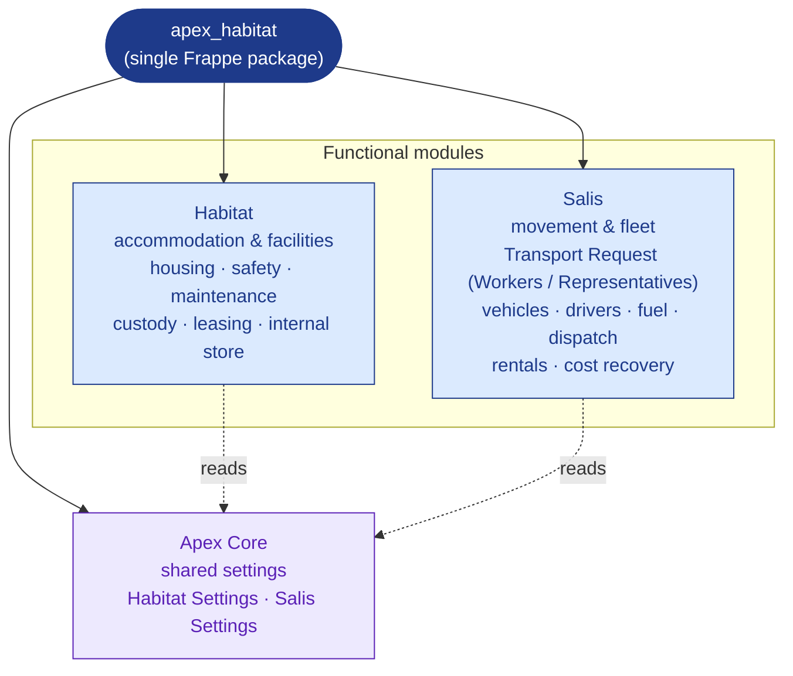
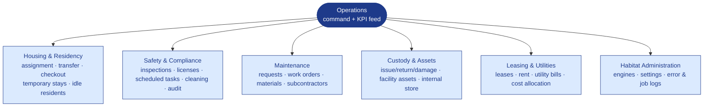
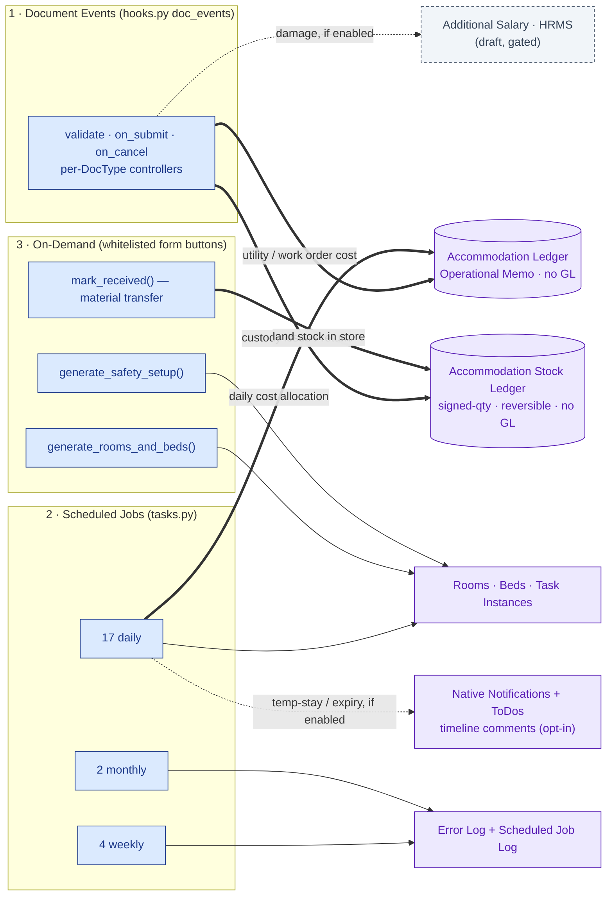
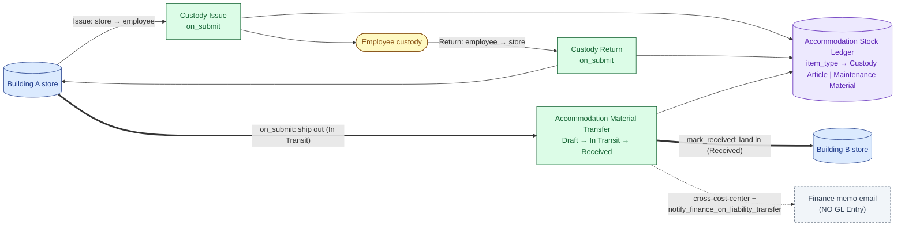
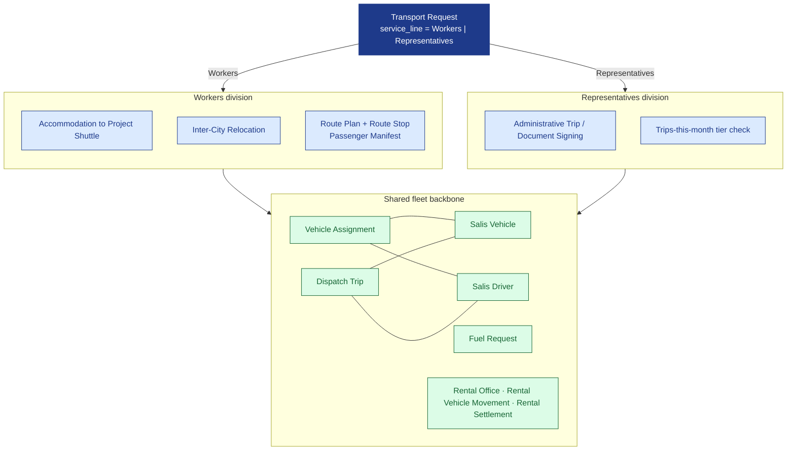

# Apex

**Apex** is an enterprise workforce-operations suite built on Frappe Framework
v15, ERPNext, and HRMS. It ships as a single Frappe package (`apex_habitat`)
containing three modules: **Habitat** (accommodation & facilities), **Salis**
(movement & fleet), and **Apex Core** (shared settings). Together they run the
estate-to-resident housing lifecycle and the worker/representative movement
lifecycle on one platform.

Its defining architectural decision is a **memo-ledger cost model**: every
operational cost and every stock movement is captured in purpose-built, read-only
*memo* ledgers that are deliberately isolated from the ERPNext General Ledger.
Accommodation analytics, cross-charge accountability, and on-hand inventory are
fully traceable without ever touching a GL Entry, Payment Entry, or Stock Ledger
Entry. Finance posting remains a human, opt-in decision.

---

## Modules

The app is **one Frappe package (`apex_habitat`) with three modules** — never a
single module:

- **Habitat** — accommodation and facilities. Spatial inventory (sites,
  buildings, rooms, beds), resident assignment/transfer/checkout, scheduled
  safety and cleaning work, maintenance inspection and work orders, custody of
  issued assets, a decentralized internal store, and lease/utility cost control.
- **Salis** — movement and fleet. A two-division service model on the
  **Transport Request** (service line `Workers` vs `Representatives`), a shared
  vehicle/driver/fuel/dispatch backbone, vehicle rentals and movement cost
  recovery, and a native-Frappe **Workflow** approval spine across its
  submittable documents.
- **Apex Core** — shared configuration. Single DocTypes **Habitat Settings** and
  **Salis Settings** that both functional modules read for thresholds, toggles,
  and default company/cost-center.

---

## Key Capabilities

- **Resident lifecycle** — assignment, room/bed transfer, and checkout with
  occupancy counters kept consistent by a weekly reconciliation job.
- **Temporary stays** — assignments carry a `stay_type` and
  `expected_checkout_date`; a daily watchlist job and reminder Notification flag
  stays past their expected departure.
- **Idle Resident accountability** — the **Idle Resident Report** tracks
  non-deployed residents through an `Open → Acknowledged → Resolved` flow,
  routing accountability across HR, Operations, and Legal.
- **Safety & compliance** — catalog-driven scheduled tasks, daily instance
  generation, inspection reports with findings, and building-license expiry
  tracking.
- **Maintenance** — resident-raised and inspection-raised requests, work orders,
  a maintenance material catalog, and aging/backlog reporting.
- **Custody & assets** — custody issue/return/damage, facility assets and
  movements, and operational (non-financial) depreciation snapshots.
- **Decentralized internal store** — each building is its own store, backed by a
  read-only signed-quantity stock ledger with full reversal and inter-store
  transfers (v0.8.2).
- **Lease & utility cost control** — leases, rent schedules, utility bills, and a
  daily per-resident cost allocation, all posting to the memo ledger.
- **Native Frappe surfaces** — Calendar views, Kanban boards, Assignment Rules,
  declarative Notifications, Auto Email Reports, and Email Templates — all
  disabled-by-default so an operator opts into automation deliberately (v0.8.3–v0.8.5).

---

## Architecture

### 1. Package & module map

One package (`apex_habitat`) hosts three modules. The two functional modules —
**Habitat** and **Salis** — own their own DocTypes, reports, workspaces, and
backend logic; **Apex Core** holds the shared Single-DocType settings both read.

### 2. Habitat domain map

The `Habitat` module is organized into operational domains. The **Operations**
workspace is the parent surface; the others hang beneath it.

### 3. Habitat backend execution surfaces

All Habitat business logic lives on the server, distributed across three
surfaces: document-event controllers, scheduled jobs, and on-demand whitelisted
actions. The diagram shows what triggers each surface and **where its output
lands** — including the two memo boundaries (Accommodation Ledger and Stock
Ledger) that never reach the GL. (Scheduler totals shown here are
package-wide — see the Scheduled jobs table for the per-module split.)

### 4. Habitat decentralized internal store — stock flow

Custody and maintenance materials move between **building stores** and
**employee custody** through one read-only, signed-quantity ledger. Every
posting is reversible; the on-hand balance is simply
`sum(qty where is_cancelled = 0)`.

### 5. Salis — two-division movement on a shared fleet backbone

Salis splits demand at the **Transport Request** by `service_line`. The
**Workers** division moves housed labour from accommodation to project sites and
between cities (built on route plans and passenger manifests); the
**Representatives** division covers administrative trips and document signing.
Both divisions resolve onto **one shared backbone** of vehicles, drivers, fuel,
and dispatch. A server-derived `needs_operations` flag escalates a request to the
Operations authorization tier when its scope crosses a configurable threshold.

### 6. Salis — native Workflow approval spine

Salis submittable documents move through their states on **native Frappe
Workflows** (defined in `salis/workflow/`), not custom controllers. Each
Workflow enforces the role allowed per transition, a Segregation-of-Duties gate
(approver must not be the requester), and a Delegation-of-Authority tier
escalation via transition conditions. Ten documents are on the Workflow spine.

```mermaid
flowchart LR
    subgraph Spine ["salis/workflow — native Frappe Workflows"]
        direction TB
        TR2["Transport Request<br/>New → Validated → Approved → Scheduled → Fulfilled"]:::wf
        DT2["Dispatch Trip<br/>Planned → Dispatched → Completed"]:::wf
        FRq["Fuel Request<br/>Pending → Approved → Done"]:::wf
        FCl["Fuel Claim<br/>Draft → Submitted to Movement → Reconciled → Approved → Closed"]:::wf
        FEx["Fuel Exception Case<br/>Open → Under Investigation → Resolved → Closed"]:::wf
        RS["Rental Settlement<br/>Draft → Reconciled → Approved → Paid"]:::wf
        PR["Salis Payment Request<br/>Draft → Pending Finance → Approved by Finance → Paid"]:::wf
        DC["Driver Clearance<br/>Open → In Progress → Cleared"]:::wf
        STC["Sponsorship Transfer Case<br/>Open → In Progress → Completed"]:::wf
        ST["Support Ticket<br/>New → In Progress → Resolved → Closed"]:::wf
    end

    Gate{{"Per-transition role +<br/>Segregation-of-Duties gate (approver ≠ requester) +<br/>authorization-tier escalation"}}:::gate
    Spine --> Gate

    classDef wf fill:#dbeafe,stroke:#1e3a8a,color:#1e3a8a;
    classDef gate fill:#fef9c3,stroke:#854d0e,color:#854d0e;
```

### 7. Apex Core — shared settings

`Apex Core` owns no transactions; it holds two Single DocTypes that both
functional modules read at runtime. **Habitat Settings** carries Habitat toggles
(for example the opt-in custody-damage salary deduction and notification flags);
**Salis Settings** carries Salis thresholds and toggles — alert lead days, idle
and fuel limits, the fuel/passenger/write-off authorization tier thresholds, and
the driver-portal and approvals switches read by Salis controllers and Workflows.

---

## Data Integrity: the no-GL memo boundary

Apex Habitat **never** writes GL Entries, Payment Entries, or ERPNext Stock
Ledger Entries. Two custom memo ledgers carry all operational truth:

- **Accommodation Ledger** — every operational cost (daily per-resident cost
  allocation, utility bill share, work-order expense) posts here in
  `posting_mode = "Operational Memo"`. It is an analytics and accountability
  record, not an accounting entry. `on_submit` posts; `before_cancel` posts the
  reversal.
- **Accommodation Stock Ledger** — a read-only, system-written, signed-quantity
  ledger for the internal store. A blank `employee` means stock sits in a
  building store; a set `employee` means it is in that employee's custody. A
  Dynamic Link (`item_type` → *Custody Article* or *Maintenance Material*) lets
  one ledger serve both item families. Rows are posted only through helper
  functions (`post_stock_entry`, `reverse_stock_entries`, `get_store_balance`),
  never created by hand. A reversal posts a negative mirror row and marks both
  cancelled.

The **single** financial-posting exception is a draft HRMS *Additional Salary*
deduction for custody damage recovery — and it only fires when
`enable_damage_deduction` is set in Habitat Settings and a salary component is
configured. Even cross-cost-center material transfers produce only an **opt-in
Finance memo email**, never a journal. The boundary holds end to end.

### Document-event controllers

Wired in `hooks.py` under `doc_events`; logic lives in each DocType's controller
module. Submittable transactions (Assignment, Checkout, Room Bed Transfer,
Utility Bill Entry, Custody Issue/Return/Damage, Material Transfer, Work Order,
Facility Asset Movement, Scheduled Task Instance) implement
`validate` / `on_submit` / `on_cancel`. Each scheduled job paginates its source
in 500-row batches and isolates per-row errors (rollback + `log_error`) so one
bad record never aborts the run.

### Scheduled jobs

`scheduler_events` in `hooks.py` registers **17 daily, 4 weekly, and 2 monthly**
jobs across the two functional modules.

**Habitat** (8 daily / 2 weekly / 1 monthly):

| Job | Frequency | What it does |
| :-- | :-- | :-- |
| `daily_accommodation_cost_allocation` | Daily | One Accommodation Ledger memo row per active assignment per cost type (annual cost ÷ days-in-year ÷ capacity, leap-year aware). Idempotent per day. |
| `daily_building_license_expiry_check` | Daily | Sets Building License status to `Expired` / `Expiring Soon` and (if notifications on) posts a timeline comment. |
| `open_maintenance_escalation` | Daily | Flags overdue open Maintenance Requests against priority thresholds. |
| `lease_expiry_watchlist` | Daily | Marks past-due leases `Expired` and flags upcoming renewals. |
| `temporary_stay_checkout_watchlist` | Daily | Flags temporary-stay assignments past their `expected_checkout_date` and fires a reminder Notification. |
| `idle_resident_aging` | Daily | Ages open Idle Resident Reports for accountability follow-up. |
| `daily_scheduled_task_instance_generator` | Daily | Creates a Scheduled Task Instance for each active template lacking one in the current period. |
| `daily_occupancy_snapshot` | Daily | Captures an Accommodation Occupancy Snapshot for trend reporting. |
| `weekly_occupancy_sync` | Weekly | Recomputes room/building occupancy counters from live assignments to correct drift. |
| `weekly_safety_task_compliance_scan` | Weekly | Marks past-due task instances `Overdue`. |
| `monthly_rent_due_alert` | Monthly | Logs a reminder per unpaid rent schedule row. No Payment Entry. |

**Salis** (9 daily / 2 weekly / 1 monthly):

| Job | Frequency | What it does |
| :-- | :-- | :-- |
| `driver_license_expiry_watch` | Daily | Flags drivers with licenses expired or nearing expiry. |
| `idle_vehicle_watch` | Daily | Flags vehicles idle beyond the configured threshold. |
| `unreverted_topup_watch` | Daily | Flags fuel top-ups left unreverted. |
| `overdue_fuel_request_watch` | Daily | Flags fuel requests pending past the configured limit. |
| `missing_attendance_watch` | Daily | Flags drivers missing expected attendance. |
| `vehicle_compliance_expiry_watch` | Daily | Flags vehicle compliance documents expired or expiring. |
| `reconcile_operations_alerts` | Daily | Reconciles Operations Alert records to live conditions. |
| `accrue_fuel_consumption` | Daily | Accrues daily fuel consumption into the fuel ledger. |
| `daily_rental_accrual` | Daily | Accrues daily rental cost for active rental vehicle movements. |
| `vehicle_utilization_summary` | Weekly | Summarizes vehicle utilization for the week. |
| `weekly_vehicle_utilisation_snapshot` | Weekly | Captures a vehicle utilisation snapshot for trend reporting. |
| `monthly_fuel_reconciliation` | Monthly | Reconciles monthly fuel consumption against claims; idempotent per month. |

### On-demand actions

Whitelisted controller methods triggered from a form button:

- `generate_rooms_and_beds(building_name)` — idempotently builds Room and Bed
  records from the building floor plan; never overwrites occupied rooms.
- `generate_safety_setup(building_name)` — idempotently seeds Scheduled Task
  Templates from the active Safety Task Catalog, scoped to the building.
- `mark_received()` — lands an in-transit material transfer into its destination
  store.

### Native automation (opt-in by design)

Operational alerting uses native Frappe primitives, not a custom alert table —
and ships **disabled by default** so automation is an explicit operator choice:

- **Calendar views** for Scheduled Task Instance, Building License,
  Subcontractor Service Order, and Lease.
- **Kanban boards** for Room Readiness, Resident Request, and Maintenance Request.
- **Assignment Rules** (Maintenance / Resident routing) — disabled by default.
- **Notifications** — five event-driven records (incl. the temporary-stay
  reminder) with companion **Email Templates**.
- **Auto Email Reports** — scheduled report digests, disabled by default.
- **ToDo follow-up** auto-created on Resident Request assignment.
- Technical exceptions always go to the standard **Error Log** / **Scheduled Job
  Log**, never an operational feed.

The legacy `Habitat Operations Alert` DocType is deprecated for new alerts and
retained only for history; schedulers no longer write to it.

---

## Roles

`after_install` seeds four custom roles — **Accommodation Manager**,
**Resident Supervisor**, **Finance Manager**, and **Internal Auditor** — which
also ship as fixtures, alongside three role profiles (Habitat Accommodation
Manager, Habitat Resident Supervisor, Habitat Finance Reviewer). The bootstrap is
idempotent and safe to re-run, and additionally seeds custody categories and
articles, the maintenance material catalog and templates, and the safety task
catalog.

---

## Localization

Arabic localization is available through Frappe translation files
(`apex_habitat/translations/ar.csv`).

---

## Install

Apex Habitat installs like any standard Frappe app (`bench get-app` →
`bench install-app` → `bench migrate`). It requires Frappe, ERPNext, and HRMS on
v15 (declared via `required_apps` in `hooks.py`), Python 3.10+, and MariaDB
10.6+. Installation runs the idempotent `after_install` bootstrap described above.

---

## License

MIT. Published by AFMCO Support Services Co. Ltd.

