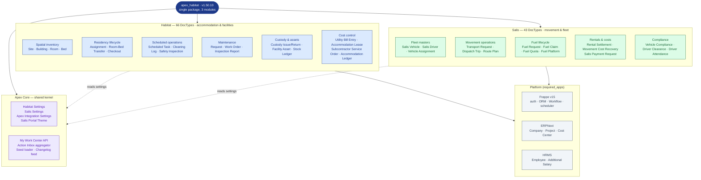
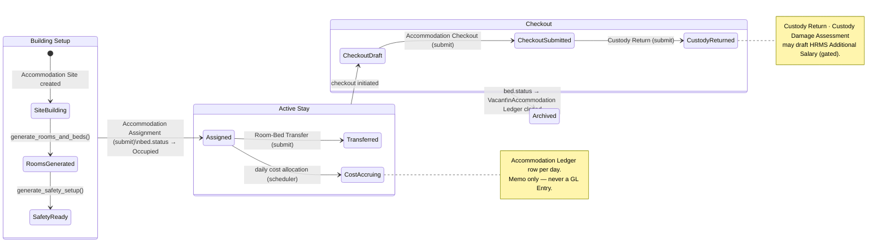
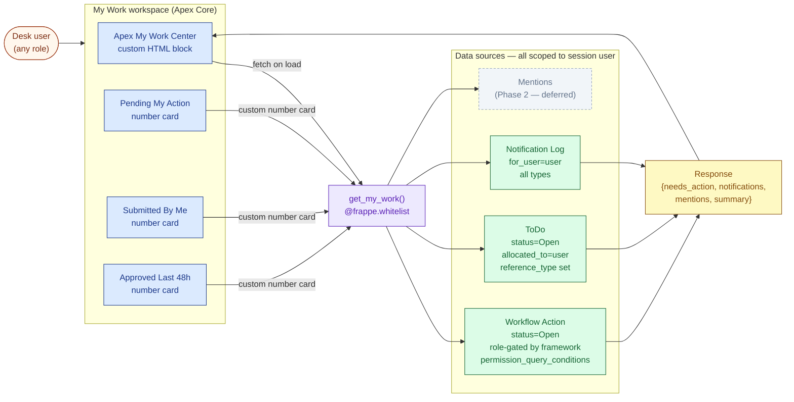
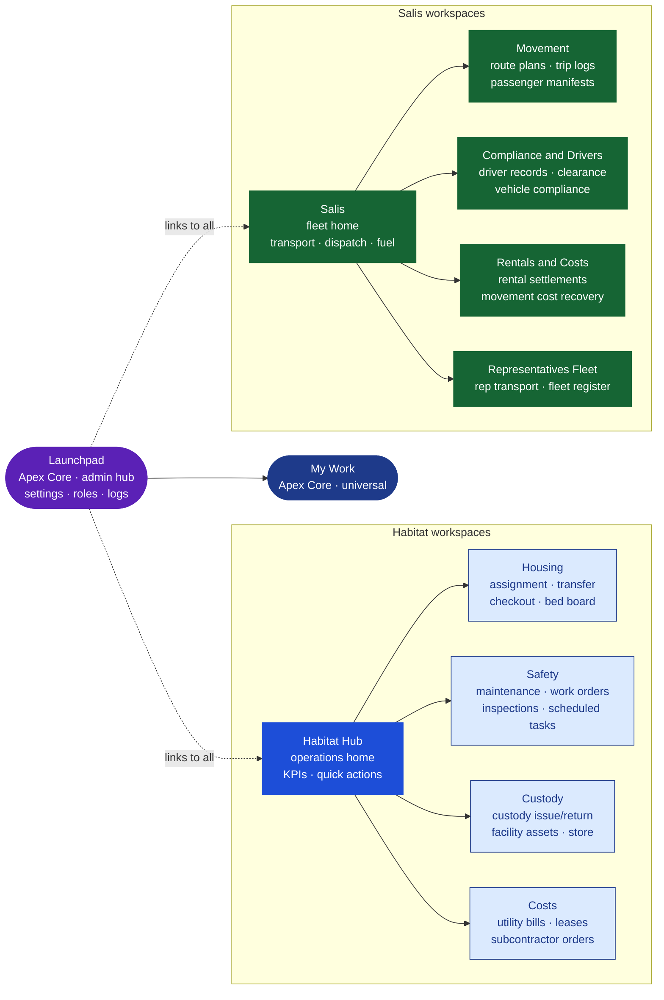
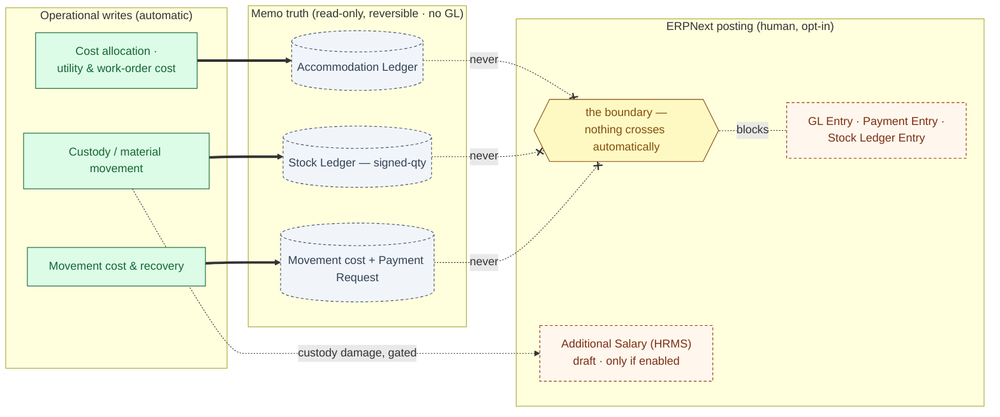

# Apex

Apex is a workforce-operations suite on Frappe v15, ERPNext, and HRMS. It runs two lifecycles on one platform: the estate-to-resident housing lifecycle and the worker/representative movement lifecycle.

Single package, three modules — **Habitat**, **Salis**, **Apex Core** — on a **memo-ledger cost model**: every operational cost posts to purpose-built read-only ledgers isolated from the ERPNext General Ledger; financial posting is a deliberate, human decision.

## Modules

- **Habitat** — accommodation and facilities: spatial inventory (sites, buildings, rooms, beds), resident assignment/transfer/checkout, scheduled safety and cleaning work, maintenance and work orders, custody of issued assets, a decentralized internal store, and lease/utility cost control.
- **Salis** — movement and fleet: a two-division service model on **Transport Request** (`service_line` = Workers vs Representatives), a shared vehicle/driver/fuel/dispatch backbone, vehicle rentals and cost recovery, a native-Frappe **Workflow** approval spine across its submittable documents, and a mobile **driver portal** (`/driver`) with a theme driver, an English/Arabic language toggle, and driver-profile and assigned-vehicle views.
- **Apex Core** — the settings hub: the Single DocTypes **Habitat Settings**, **Salis Settings**, **Apex Integration Settings**, and **Salis Portal Theme** that the functional modules and portal read for thresholds, toggles, default company/cost-center, and portal appearance.

## Architecture

Four complementary diagrams document the system from module structure down to live data flow. Each carries a one-sentence caption.

### Map 1 — Module architecture


```mermaid
graph TD
    PKG(["apex_habitat · v1.50.10<br/>single package, 3 modules"]):::hub

    subgraph CORE_BOX ["Apex Core — shared kernel"]
        CORE_SET["Habitat Settings<br/>Salis Settings<br/>Apex Integration Settings<br/>Salis Portal Theme"]:::core
        CORE_WRK["My Work Center API<br/>Action Inbox aggregator<br/>Seed loader · Changelog feed"]:::core
    end

    subgraph HAB_BOX ["Habitat — 66 DocTypes · accommodation & facilities"]
        direction TB
        HAB_SPACE["Spatial inventory<br/>Site · Building · Room · Bed"]:::hab
        HAB_ASSIGN["Residency lifecycle<br/>Assignment · Room-Bed Transfer · Checkout"]:::hab
        HAB_OPS["Scheduled operations<br/>Scheduled Task · Cleaning Log · Safety Inspection"]:::hab
        HAB_MAINT["Maintenance<br/>Request · Work Order · Inspection Report"]:::hab
        HAB_CUST["Custody & assets<br/>Custody Issue/Return · Facility Asset · Stock Ledger"]:::hab
        HAB_COST["Cost control<br/>Utility Bill Entry · Accommodation Lease<br/>Subcontractor Service Order · Accommodation Ledger"]:::hab
    end

    subgraph SAL_BOX ["Salis — 43 DocTypes · movement & fleet"]
        direction TB
        SAL_FLEET["Fleet masters<br/>Salis Vehicle · Salis Driver · Vehicle Assignment"]:::sal
        SAL_MOVE["Movement operations<br/>Transport Request · Dispatch Trip · Route Plan"]:::sal
        SAL_FUEL["Fuel lifecycle<br/>Fuel Request · Fuel Claim · Fuel Quota · Fuel Platform"]:::sal
        SAL_RENT["Rentals & costs<br/>Rental Settlement · Movement Cost Recovery<br/>Salis Payment Request"]:::sal
        SAL_COMPLY["Compliance<br/>Vehicle Compliance · Driver Clearance · Driver Attendance"]:::sal
    end

    subgraph PLATFORM ["Platform (required_apps)"]
        FRP["Frappe v15<br/>auth · ORM · Workflow · scheduler"]:::plat
        ERP["ERPNext<br/>Company · Project · Cost Center"]:::plat
        HRMS["HRMS<br/>Employee · Additional Salary"]:::plat
    end

    PKG --> CORE_BOX
    PKG --> HAB_BOX
    PKG --> SAL_BOX

    HAB_BOX -. reads settings .-> CORE_BOX
    SAL_BOX -. reads settings .-> CORE_BOX

    HAB_BOX --> PLATFORM
    SAL_BOX --> PLATFORM

    classDef hub  fill:#1e3a8a,stroke:#1e3a8a,color:#fff;
    classDef core fill:#ede9fe,stroke:#5b21b6,color:#5b21b6;
    classDef hab  fill:#dbeafe,stroke:#1e3a8a,color:#1e3a8a;
    classDef sal  fill:#dcfce7,stroke:#166534,color:#166534;
    classDef plat fill:#f1f5f9,stroke:#475569,color:#334155;
```

One package, three modules: Habitat owns the 66 accommodation and facilities DocTypes; Salis owns the 43 movement and fleet DocTypes; Apex Core is the shared kernel that both modules read for settings and that hosts the My Work aggregator.

### Map 2 — Accommodation lifecycle


```mermaid
stateDiagram-v2
    direction LR

    state "Building Setup" as SETUP {
        [*] --> SiteBuilding : Accommodation Site created
        SiteBuilding --> RoomsGenerated : generate_rooms_and_beds()
        RoomsGenerated --> SafetyReady : generate_safety_setup()
    }

    state "Active Stay" as ACTIVE {
        Assigned --> Transferred : Room-Bed Transfer (submit)
        Assigned --> CostAccruing : daily cost allocation (scheduler)
    }

    state "Checkout" as CHECKOUT {
        CheckoutDraft --> CheckoutSubmitted : Accommodation Checkout (submit)
        CheckoutSubmitted --> CustodyReturned : Custody Return (submit)
    }

    SETUP --> Assigned : Accommodation Assignment (submit)\nbed.status → Occupied
    ACTIVE --> CheckoutDraft : checkout initiated
    CHECKOUT --> Archived : bed.status → Vacant\nAccommodation Ledger closed

    note right of CostAccruing
        Accommodation Ledger row per day.
        Memo only — never a GL Entry.
    end note

    note right of CustodyReturned
        Custody Return · Custody Damage Assessment
        may draft HRMS Additional Salary (gated).
    end note
```

Traces the full resident journey from spatial setup through active occupancy and daily cost accrual to checkout and custody return, with the key DocType at each transition.

### Map 3 — My Work Center data flow


```mermaid
flowchart LR
    USER(["Desk user\n(any role)"]):::actor

    subgraph WS ["My Work workspace (Apex Core)"]
        BLOCK["Apex My Work Center\ncustom HTML block"]:::ui
        NC1["Pending My Action\nnumber card"]:::ui
        NC2["Submitted By Me\nnumber card"]:::ui
        NC3["Approved Last 48h\nnumber card"]:::ui
    end

    API["get_my_work()\n@frappe.whitelist"]:::api

    subgraph SOURCES ["Data sources — all scoped to session user"]
        S1["Workflow Action\nstatus=Open\nrole-gated by framework\npermission_query_conditions"]:::src
        S2["ToDo\nstatus=Open\nallocated_to=user\nreference_type set"]:::src
        S3["Notification Log\nfor_user=user\nall types"]:::src
        S4["Mentions\n(Phase 2 — deferred)"]:::stub
    end

    RESP["Response\n{needs_action, notifications,\nmentions, summary}"]:::data

    USER --> WS
    BLOCK -- "fetch on load" --> API
    NC1 & NC2 & NC3 -- "custom number card" --> API
    API --> S1
    API --> S2
    API --> S3
    API --> S4
    S1 & S2 --> RESP
    S3 --> RESP
    RESP --> BLOCK

    classDef actor fill:#fff7ed,stroke:#9a3412,color:#7c2d12;
    classDef ui    fill:#dbeafe,stroke:#1e3a8a,color:#1e3a8a;
    classDef api   fill:#ede9fe,stroke:#5b21b6,color:#5b21b6;
    classDef src   fill:#dcfce7,stroke:#166534,color:#166534;
    classDef stub  fill:#f1f5f9,stroke:#94a3b8,color:#64748b,stroke-dasharray:4 3;
    classDef data  fill:#fef9c3,stroke:#854d0e,color:#854d0e;
```

Shows how the My Work workspace custom block calls a single whitelisted API that unions four permission-scoped sources and returns a structured payload the block renders as tabs.

### Map 4 — Workspace navigation


```mermaid
graph LR
    MW(["My Work\nApex Core · universal"]):::universal

    subgraph HAB_NAV ["Habitat workspaces"]
        HUB["Habitat Hub\noperations home\nKPIs · quick actions"]:::hub_ws
        HOUSING["Housing\nassignment · transfer\ncheckout · bed board"]:::ws
        SAFETY["Safety\nmaintenance · work orders\ninspections · scheduled tasks"]:::ws
        CUSTODY["Custody\ncustody issue/return\nfacility assets · store"]:::ws
        COSTS["Costs\nutility bills · leases\nsubcontractor orders"]:::ws
    end

    subgraph SAL_NAV ["Salis workspaces"]
        SALIS["Salis\nfleet home\ntransport · dispatch · fuel"]:::sal_ws
        MOVE["Movement\nroute plans · trip logs\npassenger manifests"]:::sal_ws
        COMP["Compliance and Drivers\ndriver records · clearance\nvehicle compliance"]:::sal_ws
        RENT["Rentals and Costs\nrental settlements\nmovement cost recovery"]:::sal_ws
        REPS["Representatives Fleet\nrep transport · fleet register"]:::sal_ws
    end

    LP(["Launchpad\nApex Core · admin hub\nsettings · roles · logs"]):::launch

    HUB --> HOUSING
    HUB --> SAFETY
    HUB --> CUSTODY
    HUB --> COSTS

    SALIS --> MOVE
    SALIS --> COMP
    SALIS --> RENT
    SALIS --> REPS

    LP -. links to all .-> HUB
    LP -. links to all .-> SALIS
    LP --> MW

    classDef universal fill:#1e3a8a,stroke:#1e3a8a,color:#fff;
    classDef launch    fill:#5b21b6,stroke:#5b21b6,color:#fff;
    classDef hub_ws    fill:#1d4ed8,stroke:#1d4ed8,color:#fff;
    classDef sal_ws    fill:#166534,stroke:#166534,color:#fff;
    classDef ws        fill:#dbeafe,stroke:#1e3a8a,color:#1e3a8a;
```

Shows the 12 public workspaces grouped by module, the Habitat Hub and Salis parent-child hierarchy, and Launchpad as the cross-module admin entry point; My Work is the universal personal inbox independent of both modules.

### Backend surfaces

All business logic lives on the server across three surfaces:

- **Document events** — `validate` / `on_submit` / `on_cancel` controllers wired in `hooks.py` (`doc_events`) on submittable transactions.
- **Scheduled jobs** — `scheduler_events` registers **17 daily, 4 weekly, 1 monthly** jobs across Habitat and Salis (cost accrual, occupancy sync, compliance and expiry watches, fuel/rental accrual, monthly reconciliations). Each paginates its source in 500-row batches and isolates per-row failures so one bad record never aborts a run.
- **On-demand actions** — whitelisted form buttons: `generate_rooms_and_beds`, `generate_safety_setup`, `mark_received`.
- **Operator desk pages** — purpose-built single-screen consoles: **Front Desk** (bed board), **Arrivals Desk** (building-first check-in with floor-map, custody store, QR, and signed prints), and **Action Inbox** (Apex Core, unions Workflow Actions + ToDos with inline Approve/Reject).

Operational alerting uses native Frappe primitives — Calendar views, Kanban boards, Assignment Rules, Notifications with Email Templates, Auto Email Reports, and ToDo follow-ups — all **disabled by default**, so automation is an explicit operator choice. Technical exceptions go to the standard Error Log and Scheduled Job Log.

## Data integrity: the no-GL boundary

Apex **never** writes GL Entries, Payment Entries, or ERPNext Stock Ledger Entries. Every operational write resolves to a module-owned memo record; the General Ledger sits on the far side of a line nothing crosses automatically.


```mermaid
flowchart LR
    subgraph Ops ["Operational writes (automatic)"]
        direction TB
        COST["Cost allocation ·<br/>utility & work-order cost"]:::engine
        STK["Custody / material movement"]:::engine
        MOVE["Movement cost & recovery"]:::engine
    end

    subgraph Memo ["Memo truth (read-only, reversible · no GL)"]
        direction TB
        AL[("Accommodation Ledger")]:::sink
        SL[("Stock Ledger — signed-qty")]:::sink
        ML[("Movement cost + Payment Request")]:::sink
    end

    subgraph GL ["ERPNext posting (human, opt-in)"]
        direction TB
        BAR{{"the boundary —<br/>nothing crosses automatically"}}:::gate
        GLE["GL Entry · Payment Entry ·<br/>Stock Ledger Entry"]:::ext
        ADD["Additional Salary (HRMS)<br/>draft · only if enabled"]:::ext
    end

    COST ==> AL
    STK ==> SL
    MOVE ==> ML
    AL -. never .-x BAR
    SL -. never .-x BAR
    ML -. never .-x BAR
    BAR -. blocks .- GLE
    STK -. custody damage, gated .-> ADD

    classDef engine fill:#dcfce7,stroke:#166534,color:#166534;
    classDef sink fill:#f1f5f9,stroke:#475569,color:#334155,stroke-dasharray:4 3;
    classDef gate fill:#fef9c3,stroke:#854d0e,color:#854d0e;
    classDef ext fill:#fff7ed,stroke:#9a3412,color:#7c2d12,stroke-dasharray:4 3;
```

Two memo ledgers carry all operational truth. The **Accommodation Ledger** records cost posts on submit and reversal on cancel. The **Accommodation Stock Ledger** is a signed-quantity read-only ledger; on-hand = `sum(qty where is_cancelled = 0)`. The only financial-posting exception is a draft HRMS *Additional Salary* deduction for custody damage, gated by Habitat Settings.

## Roles and bootstrap

An idempotent `after_install` bootstrap creates all custom roles, role profiles, and the custody, maintenance-material, and safety-task catalogs. It re-runs safely on `bench migrate`.

### Custom Habitat roles (7)

| Role | Purpose |
|---|---|
| `Accommodation Manager` | Full operational and supervisory access across all Habitat DocTypes |
| `Resident Supervisor` | Building-scoped oversight: assignments, cleaning logs, custody, safety |
| `Finance Manager` | Financial review: utility bills, leases, accommodation costs |
| `Internal Auditor` | Read-only access with report/export rights on custody, asset, ledger, and financial DocTypes — no write, submit, or cancel |
| `Maintenance Technician` | Read and update Maintenance Work Orders |
| `Cleaning Supervisor` | Create and submit Cleaning Logs for assigned buildings |
| `Safety Officer` | Create, write, and submit Safety Task Executions, Safety Inspection Reports, and Building License records |
| `Resident Request Coordinator` | Create and manage Accommodation Resident Requests |

### Native ERPNext/HRMS roles reused

`Purchase User`, `Stock User`, `HR User`, `Maintenance User` — standard ERPNext/HRMS roles; never re-created by this app.

### Role Profiles (7)

| Profile | Bundled Roles |
|---|---|
| `Habitat Accommodation Manager` | Accommodation Manager, System Manager |
| `Habitat Resident Supervisor` | Resident Supervisor |
| `Habitat Finance Reviewer` | Finance Manager, Internal Auditor |
| `Habitat Maintenance Technician` | Maintenance Technician |
| `Habitat Cleaning Supervisor` | Cleaning Supervisor |
| `Habitat Safety Officer` | Safety Officer |
| `Habitat Resident Request Coordinator` | Resident Request Coordinator |

### Maintenance ticket intake

Any logged-in user can raise a Maintenance Request and sees only their own tickets. The assigned `Maintenance Technician` also sees their ticket. Privileged roles (`Accommodation Manager`, `Resident Supervisor`, `Resident Request Coordinator`) see all. Owner-scoping is enforced by DocPerm `if_owner` + a `permission_query_conditions` hook.

### Internal Auditor visibility

`Internal Auditor` holds `read + report + export` (no write/submit/cancel) on: Accommodation Ledger, Facility Asset, Facility Asset Movement, Facility Asset Custody Assignment, Custody Issue, Custody Return, Custody Damage Assessment, Cleaning Log, Utility Bill Entry, and Accommodation Lease.

## Localization

The desk is delivered in Arabic via `apex_habitat/translations/ar.csv`. The driver portal is English-first with an in-portal English/Arabic toggle.

## Install

Apex installs like any standard Frappe app:

```bash
bench get-app apex_habitat
bench --site <site> install-app apex_habitat
bench --site <site> migrate
```

Requires Frappe, ERPNext, and HRMS on v15 (declared via `required_apps`), Python 3.10+, and MariaDB 10.6+. Installation runs the idempotent `after_install` bootstrap.

## License

MIT. Published by AFMCO Support Services Co. Ltd.
