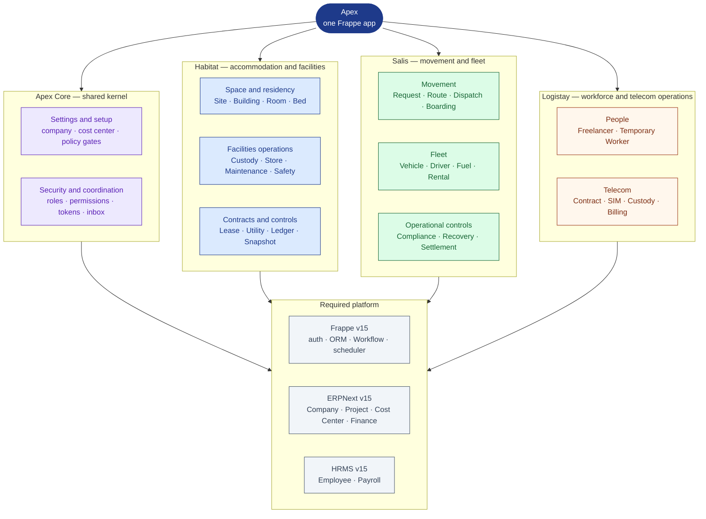
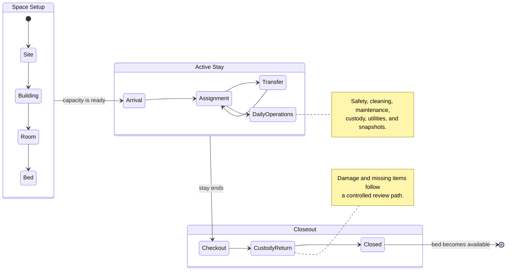
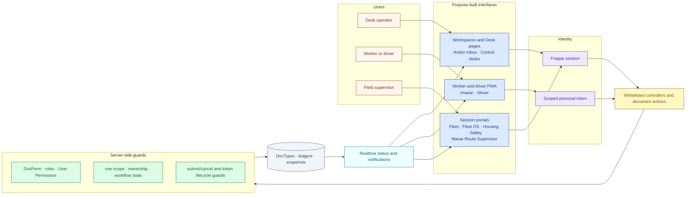
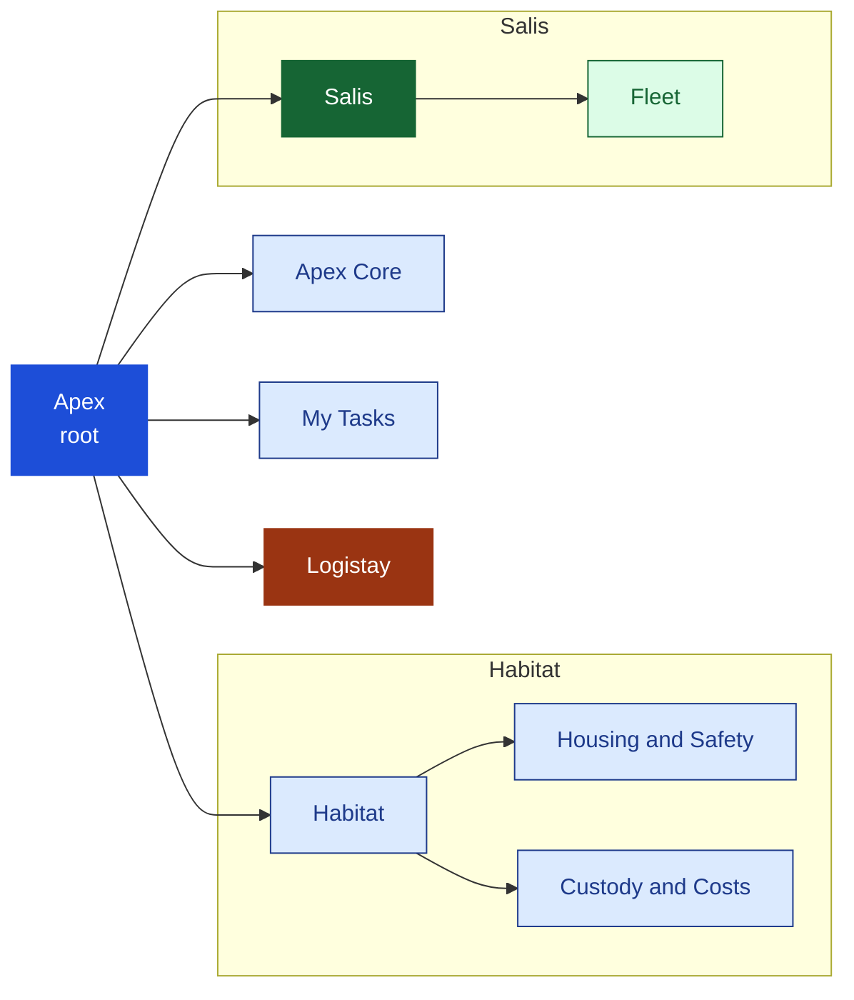
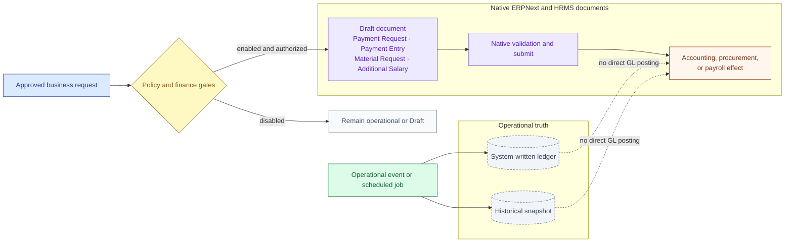

# Apex

Apex is a Frappe v15 workforce-operations suite for accommodation, movement, fleet, contingent workers, and telecom custody.

It combines native Frappe, ERPNext, and HRMS records with focused workflows, operator desks, mobile portals, and system-written operational ledgers. Financial documents stay inside the native ERPNext and HRMS lifecycle, behind explicit approvals and settings.

## Modules

- **Habitat** — accommodation and facilities: sites, buildings, rooms, beds, arrivals, housing assignments, transfers, checkout, custody, internal stores, maintenance, safety, cleaning, leases, utilities, and operational cost snapshots.
- **Salis** — movement and fleet: vehicles, drivers, transport requests, routes, dispatch, boarding, fuel, rentals, cost recovery, compliance, and mobile operations.
- **Apex Core** — shared settings, first-install setup, role bootstrap, action inbox, permissions, notifications, portal-token security, payment routing, and salary-deduction controls.
- **Logistay** — workforce and telecom operations: freelancers paid through native ERPNext documents, temporary workers who may later be linked to an Employee, telecom contracts, SIM inventory and custody, billing documents, reports, and a focused control desk.

## Architecture

Five views describe the system without tying the documentation to volatile record counts.

### Map 1 — Application architecture


```mermaid
graph TD
    PKG(["Apex<br/>one Frappe app"]):::hub

    subgraph CORE_BOX ["Apex Core — shared kernel"]
        CORE_SET["Settings and setup<br/>company · cost center · policy gates"]:::core
        CORE_SEC["Security and coordination<br/>roles · permissions · tokens · inbox"]:::core
    end

    subgraph HAB_BOX ["Habitat — accommodation and facilities"]
        HAB_SPACE["Space and residency<br/>Site · Building · Room · Bed"]:::hab
        HAB_OPS["Facilities operations<br/>Custody · Store · Maintenance · Safety"]:::hab
        HAB_COST["Contracts and controls<br/>Lease · Utility · Ledger · Snapshot"]:::hab
    end

    subgraph SAL_BOX ["Salis — movement and fleet"]
        SAL_MOVE["Movement<br/>Request · Route · Dispatch · Boarding"]:::sal
        SAL_FLEET["Fleet<br/>Vehicle · Driver · Fuel · Rental"]:::sal
        SAL_CTRL["Operational controls<br/>Compliance · Recovery · Settlement"]:::sal
    end

    subgraph EXT_BOX ["Logistay — workforce and telecom operations"]
        LOG_PEOPLE["People<br/>Freelancer · Temporary Worker"]:::ext
        LOG_TELECOM["Telecom<br/>Contract · SIM · Custody · Billing"]:::ext
    end

    subgraph PLATFORM ["Required platform"]
        FRP["Frappe v15<br/>auth · ORM · Workflow · scheduler"]:::plat
        ERP["ERPNext v15<br/>Company · Project · Cost Center · Finance"]:::plat
        HRMS["HRMS v15<br/>Employee · Payroll"]:::plat
    end

    PKG --> CORE_BOX
    PKG --> HAB_BOX
    PKG --> SAL_BOX
    PKG --> EXT_BOX
    CORE_BOX --> PLATFORM
    HAB_BOX --> PLATFORM
    SAL_BOX --> PLATFORM
    EXT_BOX --> PLATFORM

    classDef hub  fill:#1e3a8a,stroke:#1e3a8a,color:#fff;
    classDef core fill:#ede9fe,stroke:#5b21b6,color:#5b21b6;
    classDef hab  fill:#dbeafe,stroke:#1e3a8a,color:#1e3a8a;
    classDef sal  fill:#dcfce7,stroke:#166534,color:#166534;
    classDef ext  fill:#fff7ed,stroke:#9a3412,color:#7c2d12;
    classDef plat fill:#f1f5f9,stroke:#475569,color:#334155;
```

Apex Core provides the shared controls; each business module owns its operational records and uses native platform services where they fit.

### Map 2 — Accommodation lifecycle


```mermaid
stateDiagram-v2
    direction LR

    state "Space Setup" as SETUP {
        [*] --> Site
        Site --> Building
        Building --> Room
        Room --> Bed
    }

    state "Active Stay" as ACTIVE {
        Arrival --> Assignment
        Assignment --> Transfer
        Transfer --> Assignment
        Assignment --> DailyOperations
    }

    state "Closeout" as CLOSEOUT {
        Checkout --> CustodyReturn
        CustodyReturn --> Closed
    }

    SETUP --> Arrival : capacity is ready
    ACTIVE --> Checkout : stay ends
    Closed --> [*] : bed becomes available

    note right of DailyOperations
        Safety, cleaning, maintenance,
        custody, utilities, and snapshots.
    end note

    note right of CustodyReturn
        Damage and missing items follow
        a controlled review path.
    end note
```

The resident journey shares one spatial model and one controlled path from arrival to release of the bed.

### Map 3 — Interface and authorization flow


```mermaid
flowchart LR
    subgraph USERS ["Users"]
        DESK_USER["Desk operator"]:::actor
        MOBILE_USER["Worker or driver"]:::actor
        TEAM_USER["Field supervisor"]:::actor
    end

    subgraph UI ["Purpose-built interfaces"]
        DESK["Workspaces and Desk pages<br/>Action Inbox · Control desks"]:::ui
        PWA["Worker and driver PWA<br/>/masar · /driver"]:::ui
        PORTALS["Session portals<br/>Fleet · Fleet OS · Housing · Safety<br/>Masar Route Supervisor"]:::ui
    end

    subgraph ID ["Identity"]
        SESSION["Frappe session"]:::api
        TOKEN["Scoped personal token"]:::api
    end

    API["Whitelisted controllers and document actions"]:::data

    subgraph GUARDS ["Server-side guards"]
        PERM["DocPerm · roles · User Permission"]:::guard
        SCOPE["row scope · ownership · workflow state"]:::guard
        LIFE["submit/cancel and token lifecycle guards"]:::guard
    end

    STORE[("DocTypes · ledgers · snapshots")]:::store
    LIVE["Realtime status and notifications"]:::live

    DESK_USER --> DESK --> SESSION
    MOBILE_USER --> PWA --> TOKEN
    TEAM_USER --> PORTALS --> SESSION
    SESSION --> API
    TOKEN --> API
    API --> GUARDS
    GUARDS --> STORE
    STORE --> LIVE
    LIVE --> DESK
    LIVE --> PWA
    LIVE --> PORTALS

    classDef actor fill:#fff7ed,stroke:#9a3412,color:#7c2d12;
    classDef ui    fill:#dbeafe,stroke:#1e3a8a,color:#1e3a8a;
    classDef api   fill:#ede9fe,stroke:#5b21b6,color:#5b21b6;
    classDef data  fill:#fef9c3,stroke:#854d0e,color:#854d0e;
    classDef guard fill:#dcfce7,stroke:#166534,color:#166534;
    classDef store fill:#f1f5f9,stroke:#475569,color:#334155;
    classDef live  fill:#ecfeff,stroke:#0e7490,color:#155e75;
```

The interface changes by role, but identity, authorization, workflow checks, and data scope remain server-side.

### Map 4 — Workspace navigation


```mermaid
graph LR
    APEX["Apex<br/>root"]:::hub_ws

    CORE["Apex Core"]:::ws
    TASKS["My Tasks"]:::ws
    LOG["Logistay"]:::log_ws

    subgraph HAB_NAV ["Habitat"]
        HAB["Habitat"]:::ws
        HS["Housing and Safety"]:::ws
        CC["Custody and Costs"]:::ws
    end

    subgraph SAL_NAV ["Salis"]
        SALIS["Salis"]:::sal_ws
        FLEET["Fleet"]:::sal_child
    end

    APEX --> CORE
    APEX --> HAB
    APEX --> SALIS
    APEX --> LOG
    APEX --> TASKS

    HAB --> HS
    HAB --> CC
    SALIS --> FLEET

    classDef hub_ws     fill:#1d4ed8,stroke:#1d4ed8,color:#fff;
    classDef ws         fill:#dbeafe,stroke:#1e3a8a,color:#1e3a8a;
    classDef sal_ws     fill:#166534,stroke:#166534,color:#fff;
    classDef sal_child  fill:#dcfce7,stroke:#166534,color:#166534;
    classDef log_ws     fill:#9a3412,stroke:#9a3412,color:#fff;
```

Nine public workspaces ship as `is_standard` JSON, one directory per owning module under `apex/apex_core/workspace/`, `apex/habitat/workspace/`, `apex/salis/workspace/` and `apex/logistay/workspace/`. **Apex** is the single root; **Habitat** and **Salis** are domain roots that carry the screens beneath them. A module gets a workspace per screen an operator opens, not one per module, which is why Habitat has two children and Salis one. The personal **Action Inbox** is a shortcut on the module roots, not a workspace of its own. Every row above — parent, order and role gate — is listed in [modules, workspaces, and routes](docs/reference/routes-workspaces.md), which is generated from the Workspace JSON itself.

Logistay ships one workspace and **owns** the telecom model — `SIM Card`, `SIM Custody Assignment`, `Telecom Contract`, and `Telecom Billing Document`, together with its telecom reports, number cards, and the **Telecom Control** Desk page, every one of them declaring `"module": "Logistay"`. Custody is the second navigation host: the **Custody and Costs** workspace carries the Telecom Control shortcut beside the custody flow, and the `SIM Operations User` role is granted on both. This split is deliberate and settled — a SIM in an employee's hands is a custody record, so it belongs next to the rest of the company property an employee holds, while the module that owns the data stays Logistay. Ownership and navigation are separate questions here, and they have separate answers.

## Backend surfaces

- **Document lifecycle** — validation, workflow, submission, cancellation, and reversal rules live in server controllers and hooks.
- **Scheduled engines** — recurring occupancy, cost, compliance, expiry, fuel, rental, reconciliation, and notification work runs through the Frappe scheduler.
- **Operator desks** — focused pages support arrivals, front desk, custody, safety, transfers, fleet control, dispatch, fuel approval, and telecom control.
- **Operational records** — ledgers and historical snapshots are written by the system, not entered or edited by operators.
- **Native coordination** — assignments, notifications, reports, list views, calendars, workflows, and error logs use Frappe primitives.

## Financial boundary

Operational engines do not write directly to the General Ledger. When a process needs procurement, payment, or payroll action, Apex routes it to a native ERPNext or HRMS document with its own permission, approval, validation, and submission lifecycle.


```mermaid
flowchart LR
    EVENT["Operational event or scheduled job"]:::engine

    subgraph MEMO ["Operational truth"]
        LEDGER[("System-written ledger")]:::sink
        SNAP[("Historical snapshot")]:::sink
    end

    APPROVED["Approved business request"]:::request
    ROUTE{"Policy and finance gates"}:::gate

    subgraph NATIVE ["Native ERPNext and HRMS documents"]
        DRAFT["Draft document<br/>Payment Request · Payment Entry<br/>Material Request · Additional Salary"]:::native
        SUBMIT["Native validation and submit"]:::native
        EFFECT["Accounting, procurement,<br/>or payroll effect"]:::effect
    end

    EVENT --> LEDGER
    EVENT --> SNAP
    APPROVED --> ROUTE
    ROUTE -- "disabled" --> HOLD["Remain operational or Draft"]:::hold
    ROUTE -- "enabled and authorized" --> DRAFT
    DRAFT --> SUBMIT
    SUBMIT --> EFFECT
    LEDGER -. "no direct GL posting" .-> EFFECT
    SNAP -. "no direct GL posting" .-> EFFECT

    classDef engine  fill:#dcfce7,stroke:#166534,color:#166534;
    classDef sink    fill:#f1f5f9,stroke:#475569,color:#334155,stroke-dasharray:4 3;
    classDef request fill:#dbeafe,stroke:#1e3a8a,color:#1e3a8a;
    classDef gate    fill:#fef9c3,stroke:#854d0e,color:#854d0e;
    classDef native  fill:#ede9fe,stroke:#5b21b6,color:#5b21b6;
    classDef effect  fill:#fff7ed,stroke:#9a3412,color:#7c2d12;
    classDef hold    fill:#f8fafc,stroke:#64748b,color:#475569;
```

Finance and salary-deduction switches are disabled by default. Enabling them does not bypass native ERPNext or HRMS controls.

## Interface layout

Modern interfaces use a conventional source-build-route-test separation:

```text
frontend/      Vue and Vite source applications — one npm workspace
apex/public/   compiled browser assets — one committed bundle per portal
apex/www/      Frappe routes, page shells, and the authentication bootstrap
```

`frontend/` is a single npm workspace of seven packages — `fleet`, `fleet_os`, `frontend_shared`, `housing`, `route_supervisor`, `safety`, and `worker`. The driver screens are folded into `worker`: they keep their own source tree at `frontend/driver/src`, which declares no manifest and is not an eighth package — `worker` imports it and builds both service workers, so `ls frontend/` shows one more directory than the workspace list. `frontend/package.json` is the only manifest that declares dependencies and `frontend/package-lock.json` the only lockfile, so a framework version cannot drift between portals. `npm run build` rebuilds all six committed bundles under `apex/public/`. The shared runtime, the Vite config factory, and the portal `src/` skeleton are documented in [`frontend/frontend_shared/README.md`](frontend/frontend_shared/README.md).

### Served portal routes

Apex serves **seven** portal routes. Each one is a single `apex/www/<route>.html` Jinja shell plus the matching controller that owns its authentication path — routing is pure `www/` file convention, with no `website_route_rules` or `page_renderer` indirection. Controllers are cited by module rather than by line, so ordinary edits inside a controller cannot silently outdate this table.

| Route | Audience | Authentication path | Controller · bundle |
|---|---|---|---|
| `/driver` | Salis drivers, who are not Frappe users | Guest-accessible. The personal `?d=<token>` link is charset-validated, throttled, parked in an httpOnly cookie, then stripped from the URL by a redirect; every endpoint re-resolves the driver from that token server-side. | `apex/www/driver.py` · `worker_portal` |
| `/masar` | Housed and transported workers, who are not Frappe users | Guest-accessible. The same personal-token pattern on `?w=<token>`; every query is scoped to the one Employee the token resolves to. | `apex/www/masar.py` · `worker_portal` |
| `/fleet` | Any logged-in employee — their own vehicle, fuel request, and recent trips | Guest redirect, then **no role gate**: every signed-in user may open the page. Data is scoped per user on the server by `apex.salis.api.fleet_employee` (4 endpoints). | `apex/www/fleet.py` · `fleet_portal` |
| `/fleet-os` | Fleet supervisors — the whole scoped fleet board | Guest redirect, then `FLEET_ROLES`: System Manager, Fleet Manager, Fleet Project Manager, Fleet Supervisor. Backed by `apex.salis.api.fleet_os` (13 endpoints), each re-checking `Salis Vehicle` permission server-side. | `apex/www/fleet_os.py` · `fleet_os_portal` |
| `/housing` | Accommodation operators — the periodic housing inventory count and the three-exit facility-asset delivery clearance | Guest redirect, then `HOUSING_ROLES`: System Manager, Accommodation Manager, Resident Supervisor, Procurement Supervisor. That set is the union of the two flows' write roles, and a Resident Supervisor is further confined to their own buildings. | `apex/www/housing.py` · `housing_portal` |
| `/safety` | Safety supervisors — pick a building, work the checklist cadences that are due, submit one round per cadence | Guest redirect, then `SAFETY_ROLES`: System Manager, Accommodation Manager, Resident Supervisor. | `apex/www/safety.py` · `safety_portal` |
| `/masar-supervisor` | Route supervisors who dispatch buses | Guest redirect, then `SUPERVISOR_ROLES`: System Manager, Fleet Manager, Fleet Project Manager, Fleet Supervisor. Every read is additionally row-scoped to the caller's own route plans, so the role gate is a coarse door and not the data boundary. | `apex/www/masar_supervisor.py` · `route_supervisor_portal` |

`/fleet` and `/fleet-os` are **not** duplicates, and both are permanently supported. The first is the employee self-service page, open to anyone signed in; the second is the supervisor board behind a four-role gate. Their endpoint sets are disjoint: `apex.salis.api.fleet_employee` serves 4, `apex.salis.api.fleet_os` serves 13, and no endpoint name appears on both sides. Ten of the board's thirteen have no equivalent anywhere else in the application — `search_drivers`, `get_status_meta`, `create_handover`, `stop_vehicle`, `report_theft`, `workshop_in`, `workshop_out`, `bulk_stop_vehicles`, `bulk_workshop_in`, and `recover`. Only three overlap anything: the board read, the vehicle timeline, and the driver reassignment are also offered by the Desk-side `apex.salis.api.operations_control`, over a different key (vehicle name rather than plate) and to a Desk audience rather than a portal one.

Merging or retiring either route was considered and rejected. There is no parity between them to consolidate toward, and folding the supervisor board away would drop ten working capabilities without removing a single user-facing surface. Treat the pair as settled architecture, not a pending consolidation.

What the two portals genuinely share is a small amount of literal copy: five byte-identical files across `frontend/fleet/src` and `frontend/fleet_os/src` — `api.js`, `main.js`, `useToast.js`, `components/Icon.vue`, and `components/LangToggle.vue`, 200 lines together — plus the `FLEET_ROLES` set and the `has_apps_screen_access()` helper spelled out twice across the two controllers. That is a housekeeping item to fold into `frontend/frontend_shared`, and it is not a reason to retire a route.

On a gated route, a logged-in user without the required role gets a friendly access page rather than a raw 403. The role gate is only the door: every endpoint re-checks document permission and row scope on the server.

`/housing-count` is not a portal route. It is a legacy address kept alive only to redirect to `/housing#/count`, and it is the one `apex/www/*.html` file that is not a portal shell: `housing-count.html` is a redirect marker that mounts no application and loads no bundle. The marker cannot be deleted — Frappe resolves a `www` route by template file, so without it the sibling `housing_count.py` is never imported and the address answers 404 instead of redirecting. The parity guard below excludes it structurally rather than by name: a `www` page counts as a portal route only when its shell loads a portal bundle, and this one loads none.

Each route also gets a tile on the Frappe `/apps` selector, declared in `add_to_apps_screen` (`apex/hooks.py`). The gated tiles reuse the page's own role set through a `has_apps_screen_access()` helper that sits next to it, so a tile can never be shown to a user the page would turn away.

Desk users work through native workspaces, forms, reports, and operator pages. Mobile users receive smaller role-focused interfaces, including a shared worker and driver PWA reached by personal token.

### Keeping the route table honest

The table above is a published description of a directory that changes whenever a portal is added, split, or retired, and it is written by hand — the audience and design notes in it are judgements, not facts a script can read off the tree.

The facts are published separately and are not hand-maintained. [Modules, workspaces, and routes](docs/reference/routes-workspaces.md) is generated from the shipped `modules.txt`, Workspace JSON, Page JSON and `www/` templates: the route, the controller module, the bundle its shell mounts, whether guests are redirected to login, and the exact role set the controller's `get_context()` applies. A shipped route the page omits, or a role added to or dropped from a gate constant, changes the generated file. Regenerating it must leave the tree unchanged; that check runs in the maintainer's local guard sweep, not in CI, so a clone carries the page but not the gate that keeps it current. When the two disagree, the generated page is the one to believe.

## Security and integrity

- Roles, document permissions, ownership, building or project scope, and workflow state are enforced on the server.
- Portal tokens are personal and purpose-scoped; they do not grant Desk roles or broader document access.
- Submission and cancellation guards protect workflow-controlled records from bypass.
- Machine-written ledgers and snapshots are read-only to users; no workspace offers a create path into them.

## Localization

Source code and metadata are English-first. User-facing Arabic is maintained through Frappe translation files, and supported portals provide an Arabic interface.

## Install

```bash
cd frappe-bench
bench get-app https://github.com/iabodysa/apex.git
bench --site <site> install-app apex
bench --site <site> migrate
```

Apex requires Frappe, ERPNext, and HRMS v15, Python 3.10+, and MariaDB 10.6+. The first-install setup wizard captures the shared company, cost center, portal controls, and approval policies with conservative defaults.

Any reverse proxy, load balancer, or CDN placed in front of the site must **overwrite** the `X-Forwarded-For` header rather than append to it. Frappe reads the first entry of that header as the caller's address, and every per-address limit in Apex keys on it, so an appending edge lets a caller choose its own rate-limit bucket and name any address as the source of a flood. [Reverse proxy prerequisite](docs/administration/reverse-proxy.md) states the requirement, shows the correct and incorrect proxy configuration, and gives the System Manager check that grades a running deployment against it.

## Documentation

[docs/](docs/README.md) is the index; it routes by audience — operators and trainers, administrators, integrators, reference.

- [Training guide](docs/training/README.md)
- [Installation](docs/administration/installation.md)
- [Integration guide](docs/administration/integration.md)
- [Workspace authoring](docs/administration/workspace-authoring.md)
- [Reverse proxy prerequisite](docs/administration/reverse-proxy.md)
- [Modules, workspaces, and routes](docs/reference/routes-workspaces.md)
- [Permissions and roles](docs/reference/permissions.md)

## License

MIT. Published by AFMCO Support Services Co. Ltd.
