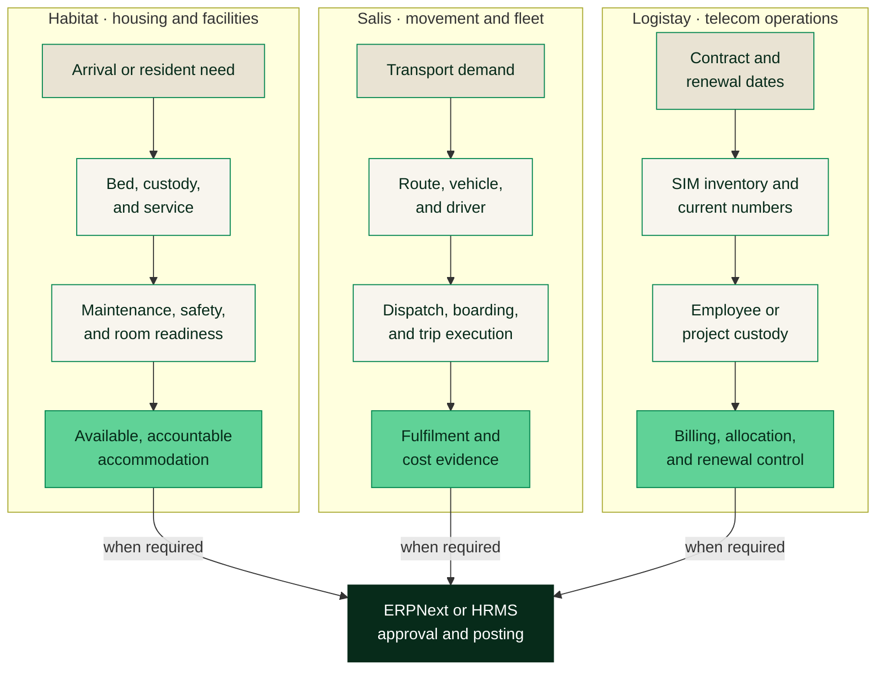
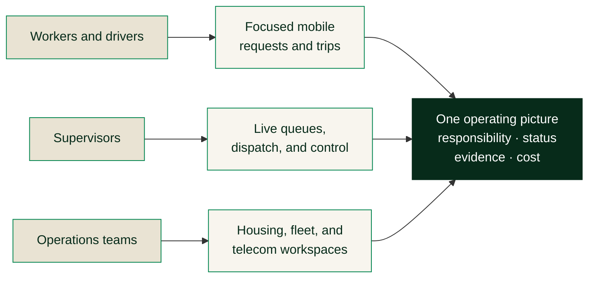

<p align="center">
  
</p>

<h1 align="center">Apex</h1>

<p align="center">
  <strong>One clear operating view for workforce housing, mobility, fleet, facilities, and telecom operations.</strong>
</p>

<p align="center">
  <a href="#what-apex-helps-you-run">Explore the product</a> ·
  <a href="#get-started">Get started</a> ·
  <a href="docs/README.md">Read the documentation</a>
</p>

---

Apex helps operations teams coordinate accommodation, transport, fleet, facilities,
contingent workers, and telecom operations across projects and sites. It replaces scattered
spreadsheets and message-based handovers with guided workflows, focused workspaces, and
mobile experiences for the people doing the work.

Managers gain current operational visibility and traceable approvals. Field teams see the
tasks and actions relevant to them. When an approved process reaches finance, procurement,
or payroll, Apex hands it to ERPNext or HRMS instead of bypassing their controls.

## How Apex connects the work

### Three operating journeys, one controlled handoff


```mermaid
flowchart TB
    subgraph HABITAT_FLOW["Habitat · housing and facilities"]
        direction LR
        HA["Arrival or resident need"] --> HB["Bed, custody,<br/>and service"]
        HB --> HC["Maintenance, safety,<br/>and room readiness"]
        HC --> HO["Available, accountable<br/>accommodation"]
    end

    subgraph SALIS_FLOW["Salis · movement and fleet"]
        direction LR
        SA["Transport demand"] --> SB["Route, vehicle,<br/>and driver"]
        SB --> SC["Dispatch, boarding,<br/>and trip execution"]
        SC --> SO["Fulfilment and<br/>cost evidence"]
    end

    subgraph TELECOM_FLOW["Logistay · telecom operations"]
        direction LR
        LA["Contract and<br/>renewal dates"] --> LB["SIM inventory and<br/>current numbers"]
        LB --> LC["Employee or<br/>project custody"]
        LC --> LO["Billing, allocation,<br/>and renewal control"]
    end

    HO -- "when required" --> ERP["ERPNext or HRMS<br/>approval and posting"]
    SO -- "when required" --> ERP
    LO -- "when required" --> ERP

    classDef intake fill:#e9e3d3,stroke:#00844e,color:#072b1a;
    classDef action fill:#f8f5ee,stroke:#00844e,color:#072b1a;
    classDef outcome fill:#60d297,stroke:#00844e,color:#072b1a;
    classDef handoff fill:#072b1a,stroke:#072b1a,color:#ffffff;
    class HA,SA,LA intake;
    class HB,HC,SB,SC,LB,LC action;
    class HO,SO,LO outcome;
    class ERP handoff;
```

Housing teams can follow a resident need into a safe, ready room. Fleet teams can prove that
planned movement became a completed trip. Telecom teams can trace every SIM from contract to
holder, cost, and renewal. Apex keeps each source and outcome linked, then hands approved
financial or payroll work to ERPNext or HRMS instead of posting around them.

### The right experience for each role


```mermaid
flowchart LR
    FIELD["Workers and drivers"] --> MOBILE["Focused mobile<br/>requests and trips"]
    SUPERVISOR["Supervisors"] --> CONTROL["Live queues,<br/>dispatch, and control"]
    OFFICE["Operations teams"] --> WORKSPACES["Housing, fleet, and<br/>telecom workspaces"]

    MOBILE --> VIEW["One operating picture<br/>responsibility · status<br/>evidence · cost"]
    CONTROL --> VIEW
    WORKSPACES --> VIEW

    classDef person fill:#e9e3d3,stroke:#00844e,color:#072b1a;
    classDef surface fill:#f8f5ee,stroke:#00844e,color:#072b1a;
    classDef hub fill:#072b1a,stroke:#072b1a,color:#ffffff;
    class FIELD,SUPERVISOR,OFFICE person;
    class MOBILE,CONTROL,WORKSPACES surface;
    class VIEW hub;
```

Field users get a small mobile experience for the job in front of them. Supervisors work
from live queues and control views. Operations teams manage the full process in focused
workspaces. Everyone contributes to the same current picture without exposing the whole
system to every user.

## What Apex helps you run

### Habitat — accommodation and facilities

Manage the resident journey from capacity planning and arrival through bed assignment,
transfer, and checkout. Keep maintenance, safety, cleaning, custody, internal supplies,
leases, and utilities connected to the buildings where the work happens.

### Salis — movement and fleet

Turn transport demand into planned routes, dispatch, boarding, and completed trips. Control
vehicle availability, driver assignments, handovers, incidents, fuel, rentals, compliance,
and cost recovery from one operating model.

### Logistay — workforce and telecom

Track telecom contracts, renewal dates, SIM inventory, employee custody, billing, and cost
allocation. Manage temporary workers and freelancers without losing the link to projects,
companies, and native payment processes.

### Apex Core — governance and coordination

Give each role a focused starting point with shared setup, a personal action inbox,
notifications, permission-aware approvals, and controlled routing to finance and payroll.
Conservative defaults keep sensitive posting and deduction features off until the business
is ready to configure them.

## Built for daily operations

- **Task-focused workspaces** keep operators close to the records, reports, and actions they
  use each day.
- **Mobile worker and driver portals** make requests, trips, boarding, attendance, vehicle
  details, and field evidence available without exposing the full Desk.
- **Supervisor views** bring fleet, routes, housing counts, safety rounds, and operational
  queues into focused screens.
- **Arabic and English experiences** support field and office teams in the language they
  use at work.
- **Scheduled follow-up** watches occupancy, maintenance, safety, contract expiry, vehicle
  compliance, fuel, rentals, and telecom status.
- **Traceable handoffs** retain approvals, evidence, ownership, and document history from
  request to completion.

## Operations stay connected to ERP

Apex keeps the operational detail for housing, transport, fleet, facilities, workforce,
and telecom in a connected trail of records. It does not create a parallel accounting or
payroll system. Outcomes that require finance, procurement, or payroll action move into
native ERPNext and HRMS documents, where the existing permissions, validations, approvals,
and submission lifecycle continue to apply.

Scoped operational users see only the records and decisions within their assigned buildings,
projects, companies, and current responsibilities. Oversight roles retain the broader view
their work requires. Personal portal links open only the intended worker or driver
experience; they do not open the wider operations workspace.

## Get started

Apex supports:

- Frappe Framework 15
- ERPNext 15
- HRMS 15
- Python `>=3.10`

Install Frappe, ERPNext, and HRMS on the target site before installing Apex. For an
evaluation or controlled deployment of the current release:

```bash
cd frappe-bench
bench get-app --branch v2.9.0 https://github.com/iabodysa/apex.git
bench --site <site> install-app apex
bench --site <site> migrate
```

Production installations should use a reviewed tag and full commit SHA, take a verified
backup, and prove the same application combination in staging before changing an existing
site.

If a reverse proxy, load balancer, or CDN sits in front of Frappe, preserve the original
client address and trusted-proxy configuration before exposing Apex.

## Documentation

- [Documentation home](docs/README.md) — choose the shortest guide for your role
- [Training guide](docs/training/README.md) — learn the daily workflows with scoped examples

## License

Apex is available under the [MIT License](license.txt).
