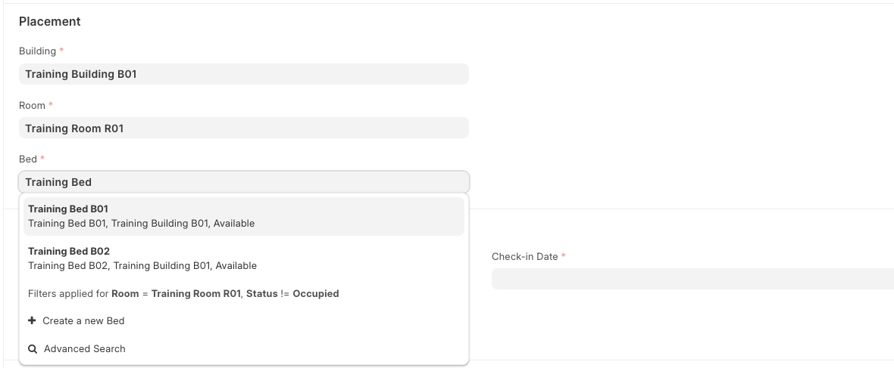
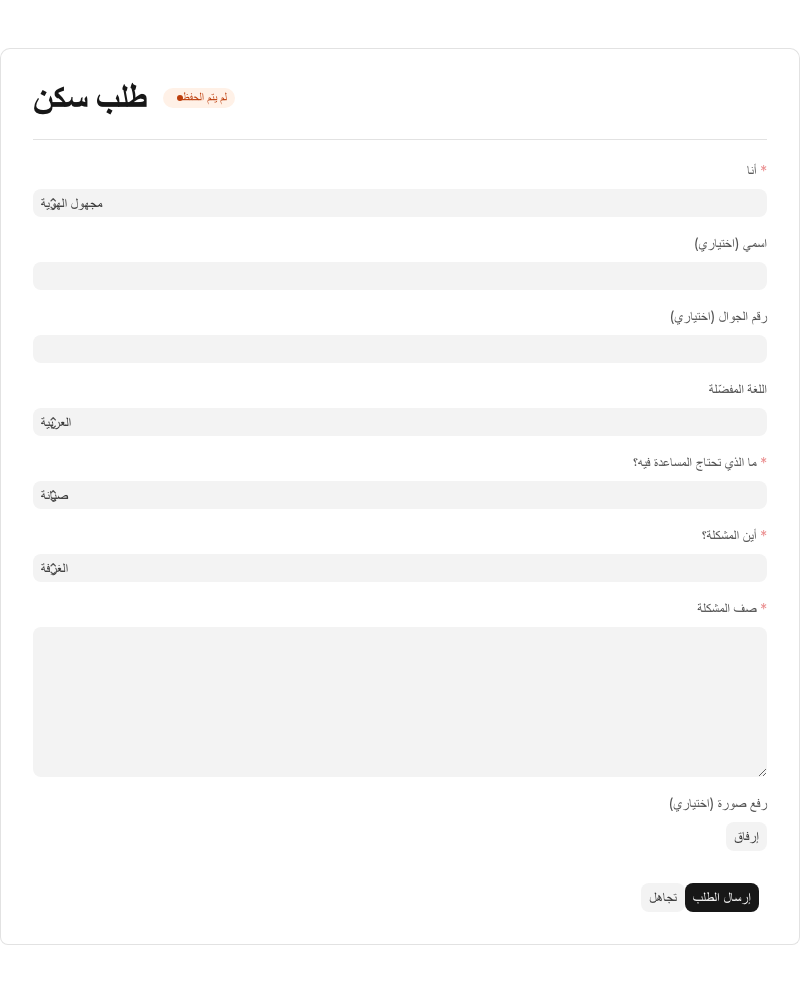

# Accommodation Operations

[Back to training index](README.md)

## Outcome

Place a resident in a safe, available bed, route a request raised during the stay, complete
checkout with occupancy and custody evidence intact, and return the cleaned Room to service.

## Intended role

The primary operator is the **Accommodation Manager**. A **Resident Supervisor** may
create and submit `Housing Assignment` and `Housing Checkout`, but cannot create a
`Room Bed Transfer` or cancel those transactions. A **Resident Request Coordinator**
owns request intake and triage. A **Cleaning Supervisor** submits the cleaning evidence;
the Accommodation Manager reviews it and marks the Room ready.

## Before starting

- Use a disposable training site and a fictional Employee or Temporary Worker.
- Prepare a Project, Cost Center, Building, Room, and Bed. Use a Building-scoped Resident
  Supervisor or Resident Request Coordinator account when the exercise includes an access
  boundary; Accommodation Manager is an oversight role and is not Building-limited.
- Confirm the Bed is **Available** and the Room readiness is **Ready** or **Unknown**.
- Use a resident with no active `Housing Assignment`. A temporary stay also needs an
  expected checkout date.
- Prepare sanitized cleaning evidence for Bathrooms, Kitchen, Corridors, and the Room.

Never practise with an occupied production Bed or a real resident record.

## Exercise: complete one stay

1. Open **Front Desk** or create a `Housing Assignment`. Select the resident, Building,
   Room, Bed, assignment and stay types, check-in date, Project, and Cost Center.

   

2. Submit the assignment. Confirm that the Bed is **Occupied** and that Room and
   Building occupancy have been recalculated.
3. Create a Maintenance-category `Resident Request` for the same Room. Move it from
   **New** to **Triaged**, then choose **Convert to Document**.

   

4. Confirm that the request is **In Progress** and links to a draft
   `Maintenance Request`. Repeating the conversion must reopen the same target, not
   create another one.
5. Create a `Housing Checkout` against the assignment. Resolve each custody line as
   **Returned**, **Lost**, or **Damaged**, confirm room clearance, and submit.
6. Confirm that the assignment has a checkout date, the Bed is **Available**, and the
   Room is **Needs Cleaning**.
7. As Cleaning Supervisor, complete and submit the `Cleaning Log` with the required area
   and Room evidence. The log records cleaning; it does not change Room readiness.
8. As Accommodation Manager, review the submitted cleaning evidence in **Front Desk**,
   choose **Mark Ready**, and confirm that the Room is **Ready** for another assignment.

## Decisions and exceptions

- A Room marked **Needs Repair**, **Needs Cleaning**, or **Out of Service** cannot be
  assigned. An out-of-service Bed cannot be selected.
- Use `Room Bed Transfer` or **Transfer Board** only within the current Building. For a
  move to another Building, check out the resident and create a new assignment.
- `Housing Checkout` does not replace a normal `Custody Return`. Return issued custody
  first where possible. Lost or damaged checkout lines create a draft
  `Custody Damage Assessment` for separate review.
- **Arrange Departure Transport** is available only after a submitted checkout whose
  reason is **Final Exit** or **End of Contract**. It creates a linked draft
  `Transport Request`; it does not dispatch transport.
- Housing-allowance suspension applies only when the Rent rule in
  `Salary Deduction Policy` is active.
- A submitted `Cleaning Log` does not make a Room ready automatically. Only a user with
  Room write access can choose **Mark Ready** after reviewing the evidence.
- Do not edit occupancy counters or system-written occupancy and cost records.

## Evidence of completion

Show the submitted `Housing Assignment`, `Housing Checkout`, and `Cleaning Log`; the linked
resident request target; the Bed and Room state changes through **Needs Cleaning** to
**Ready**; and the Project and Cost Center carried by the assignment.

## Related links

- [Custody operations](custody.md)
- [Maintenance operations](maintenance.md)
- [Housing Operations track](tracks/housing-operations.md)
- [Workspaces and routes](../reference/routes-workspaces.md)
